[toc]

## 🧊's Algorithm Template

### 食用前注意

该模板库中所有用到的数组，除了特殊说明，一般下标都是**从1开始（1-based）**，操作区间都是**左闭右闭**的区间，有些模板使用了**auto或者std::function封装**，是**为了区分输入以及函数主内容**，一般主内容都是auto或者std::function里面的内容，请自行根据题目来调整

Alpha版本**有部分板块没有教程**，未来会给每个板块增加使用教程及原理


🧊的基础模板

```cpp
#include <bits/stdc++.h>
#define endl '\n'
#define int long long
#define awa 0
typedef long long ll;
typedef std::pair<int, int> PII;
typedef std::map<int, int> MII;

signed ICE(){

    return awa;
}

signed main(){
    std::ios::sync_with_stdio(false),std::cin.tie(nullptr),std::cout.tie(nullptr);
    int T = 1;
    std::cin >> T;
    while(T--)ICE();
    return 0;
}
```


### 数学

#### 排列组合

##### 排列

```cpp
template<typename T>
T perm(T n, T k){
	T res = 1;
	for(T i = 0; i < k; i++)
		res *= (n - i);
	return res;
}
```


##### 组合

```cpp
template<typename T>
T comb(T n, T k){
	if(!k || k == n) return 1;
	k = std::min(k, n - k);
	T res = 1;
	for(T i = 1; i <= k; i++)
		res = res * (n - k + i) / i;
	return res;
}
```


### 数论

#### 加性函数和完全加性函数

**加性函数**

在数论中，若函数 $f(n)$ 满足 $f(1)=0$ ，且 $f(xy)=f(x)+f(y)$ 对**任意互质**的 $x,y \in N^*$ 都成立，则 $f(n)$ 为**加性函数**


**完全加性函数**

在数论中，若函数 $f(n)$ 满足 $f(1)=0$ ，且 $f(xy)=f(x)+f(y)$ 对**任意**的 $x,y \in N^*$ 都成立，则 $f(n)$ 为**完全加性函数**


**性质**

对正整数 $x$ ，设其唯一质因数分解为 $x=\Pi p_i^{k_i}$ ，其中 $p_i$ 为质数

> 即任何正整数 $x$ 都可以唯一地分解为若干质数的幂次乘积，例如：
>
> $12 = 2^2 * 3^1$
>
> $30 = 2^1 * 3^1 * 5^1$

若 $F(x)$ 为**加性函数**，则有 $F(x) = \Sigma F(p_i^{k_i})$

若 $F(x)$ 为**完全加性函数**，则有 $F(x) = \Sigma F(p_i^{k_i}) = \Sigma F(p_i) * k_i$


<span id="jixinghanshu"></span>

#### 积性函数与完全积性函数

**积性函数**

在数论中，若函数 $f(n)$ 满足 $f(1)=1$ ，且 $f(xy)=f(x)f(y)$ 对**任意互质**的 $x,y \in N^*$ 都成立，则 $f(n)$ 为**积性函数**


**完全积性函数**

在数论中，若函数 $f(n)$ 满足 $f(1)=1$ ，且 $f(xy)=f(x)f(y)$ 对**任意**的 $x,y \in N^*$ 都成立，则 $f(n)$ 为**完全积性函数**


**性质**

若 $f(x)$ 和 $g(x)$ 均为积性函数，则以下函数也为积性函数
$$
h(x) = f(x^p) \\
h(x) = f^p(x) \\
h(x) = f(x)g(x) \\
h(x) = \Sigma_{d|x} f(d)g(\frac{x}{d})
$$
对正整数 $x$ ，设其唯一质因数分解为 $x=\Pi p_i^{k_i}$ ，其中 $p_i$ 为质数。

> 即任何正整数 $x$ 都可以唯一地分解为若干质数的幂次乘积，例如：
>
> $12 = 2^2 * 3^1$
>
> $30 = 2^1 * 3^1 * 5^1$

若 $F(x)$ 为**积性函数**，则有 $F(x) = \Pi F(p_i^{k_i})$ 。

若 $F(x)$ 为**完全积性函数**，则有 $F(x) = \Pi F(p_i^{k_i}) = \Pi F(p_i)^{k_i}$


#### 费马小定理

**定义**

若 $p$ 为素数， $gcd(a, p) = 1$ ，则 $a^{p-1} \equiv 1 \pmod p$

对于任意整数 $a$ ，都有 $a^p \equiv a\pmod p$

证明见[费马小定理](https://oi-wiki.org/math/number-theory/fermat/)


#### 欧拉函数

**定义**

欧拉函数，即 $\varphi(n)$ ，表示的是小于等于 $n$ 和 $n$ 互质的数的个数。

例如 $\varphi(1)=1$ 。

当 $n$ 是质数的时候，显然有 $\varphi(n) = n - 1$


**性质**

* 欧拉函数是**[积性函数](#jixinghanshu)**

​	即对任意满足 $gcd(a,b) = 1$ 的整数 $a, b$ ，都有 $\varphi(ab) = \varphi(a)\varphi(b)$

​	特别的，当 $n$ 是奇数时 $\varphi(2n) = \varphi(n)$

* $n = \Sigma_{d|n} \varphi(d)$

  > 这个结论的意思是，正整数n等于它的所有正因数d的欧拉函数值$\varphi(d)$之和
  > 其中$d|n$表示$d$是$n$的正因数（即$d$能整除$n$）
  >
  > 例如n=6时，d=1, 2, 3, 6

* 若 $n=p^k$ ，其中 $p$ 是质数，那么 $\varphi(n) = p^k - p^{k-1}$

* 由唯一分解定理，设 $n=\Pi_{i=1}^s p_i^{k_i}$ ，其中 $p_i$ 是质数，有 $\varphi(n) = n * \Pi_{i=1}^s \frac{p_i - 1}{p_i}$

* 对任意不全为0的整数 $m,n, \varphi(mn) \varphi(gcd(m,n)) = \varphi(m) \varphi(n) gcd(m, n)$


**代码实现**

```cpp
auto euler_phi(int x) -> int{
  int res = x;
  for(int i = 2; i * i <= x; i++)
    if(x % i == 0){
   		res = res / i * (i - 1);
      while (x % i == 0) x /= i;
    }
 	if(x > 1) res = res / x * (x - 1);
  return res;
};
```


##### 欧拉反演

常常用于化简一列最大公约数的和

在结论 $n = \Sigma_{d|n} \varphi(d)$ 中带入 $n=gcd(a,b)$ ，则有

$gcd(a, b) = \Sigma_{d|gcd(a,b)} \varphi(d) = \Sigma[d|a][d|b]\varphi(d)$

> 其中，$[]$称为lverson括号，只有当命题 $P$ 为真时 $[P]$ 取值为1，否则取0。

对上式求和，就可以得到
$$
\Sigma_{i=1}^n gcd(i, n) = \Sigma_d \Sigma_{i=1}^n [d|i][d|n]\varphi(d) = \Sigma_d \lfloor \frac{n}{d} \rfloor \varphi(d)
$$
这里关键的是观察 $\Sigma_{i=1}^n[d|i] = \lfloor \frac{n}{d} \rfloor$ ，即在 $1$ 和 $n$ 之间能够被 $d$ 整除的 $i$ 的个数是 $\lfloor \frac{n}{d} \rfloor$

利用这个式子就可以遍历约数求和了。需要多组数据的时候，可以预处理欧拉函数的前缀和，利用数论分块查询。

> **例子**
>
> 给定 $n \leq 100000$ ，求
> $$
> \Sigma_{i=1}^n \Sigma_{j=1}^n gcd(i, j)
> $$
> 仿照上述的推导，可以得出
> $$
> \Sigma_{i=1}^n \Sigma_{j=1}^n gcd(i, j) = \Sigma_{d=1}^n \lfloor \frac{n}{d} \rfloor ^2 \varphi(d)
> $$
> 其中 $\lfloor \frac{n}{k} \rfloor ^2$ 表示$k$的倍数对 $(i, j)$ 的数量
>
> 此时只需要使用[线性筛（欧拉筛）](#eular_shai)从 $1$ 遍历到 $n$ 求欧拉函数，即可以 $O(n)$ 得到答案
>
> ```cpp
> std::vector<int> vis(n + 5), prime, phi(n + 5);
> phi[1] = 1;
> auto euler_phi = [&](int n) -> void{
>   for(int i = 2;i <= n;i++){
>     if(!vis[i]){
>       prime.push_back(i);
>       phi[i] = i - 1;
>     }
>     for(auto j : prime){
>       if(i * j > n)break;
>       vis[i * j] = true;
>       if(i % j == 0){
>         phi[i * j] = phi[i] * j;
>         break;
>       }else phi[i * j] = phi[i] * (j - 1);
>     }
>   }
> };
> euler_phi(n);
> int sum = 0;
> for(int d = 1; d <= n; d++){
>   int k = n / d;
>   sum += phi[d] * k * k;
> }
> ```


#### 欧拉定理

若 $gcd(a, m) = 1$ ，则 $a^{\varphi(m)} \equiv 1 \pmod m$


#### 扩展欧拉定理

$ a^b\equiv \begin{cases} a^{b\bmod\varphi(m)},\,&\gcd(a,\,m)=1\\ a^b,&\gcd(a,\,m)\ne1,\,b<\varphi(m)\\ a^{b\bmod\varphi(m)+\varphi(m)},&\gcd(a,\,m)\ne1,\,b\ge\varphi(m) \end{cases} \pmod m $


#### 素数

##### 判断素数

```cpp
auto is_prime = [&](int x) -> bool{
  if(x < 2)return false;
  for(int i = 2;i * i <= x;i++)
    if(x % i == 0)return false;
 	return true;
};
```


<span id="eular_shai"></span>

##### 欧拉筛

筛出素数的欧拉筛：

```cpp
std::vector<int> vis(n + 5), prime;
auto euler = [&](int n) -> void{
  for(int i = 2;i <= n;i++){
    if(!vis[i])prime.push_back(i);
    for(auto j : prime){
      if(j * i > n)break;
      vis[j * i] = true;
      if(i % j == 0)break;
    }
  }
};
```

> 若vis[x] = false，则x为素数，prime数组是按照从小到大排序的素数

求出欧拉函数值的欧拉筛：

```cpp
std::vector<int> vis(n + 5), prime, phi(n + 5);
phi[1] = 1;
auto euler_phi = [&](int n) -> void{
  for(int i = 2;i <= n;i++){
    if(!vis[i]){
      prime.push_back(i);
      phi[i] = i - 1;
    }
    for(auto j : prime){
      if(i * j > n)break;
      vis[i * j] = true;
      if(i % j == 0){
        phi[i * j] = phi[i] * j;
        break;
      }else phi[i * j] = phi[i] * (j - 1);
    }
  }
};
```


#### min_25筛(😃😭😃😭)

> 关于(😃😭😃😭)这个梗的来源可以去看24年广东省赛，大致就是THU出题，用这个当作签到题
>
> 例题：[P5325 【模板】Min_25 筛](https://www.luogu.com.cn/problem/P5325) **黑题**😱

**教程TODO**


min_25筛可以在$O(\frac{n^{\frac{3}{4}}}{log \ n})$的时间复杂度下解决[积性函数](#jixinghanshu)的前缀和问题


**模板**


#### 快速幂

```cpp
/**
	* @param base 底数
	* @param exp 指数(>=0)
	* @param MOD 模数（可选）
	* @return (base^exp) % MOD（当mod!=0时）
*/
auto qpow = [&](int base, int exp, int MOD = 0) -> int{
	int res = 1;
	if(exp == 0)return 1;
	while(exp){
		if(exp & 1)
			if(MOD)res = res * base % MOD;
			else res = res * base;
		if(MOD)base = base * base % MOD;
		else base = base * base;
		exp >>= 1;
	}
	return MOD ? res % MOD : res;
};
```

> 有两种使用方法，第一种直接传入两个参数（底数，指数），例如 $2^{10}$ 可使用qpow(2, 10)
>
> 第二种传入三个参数（底数，指数，模数），例如要求 $a^b\ mod\ c$ 则可以使用qpow(a, b, c)
>
> 时间复杂度为 $O(log(exp))$


### 计算几何

#### 扫描线


> 扫描线的思路为，将需要操作的矩阵以y轴升序排序，然后用[线段树](#SegmentTree)统计区间
>
> 每一个操作可以被抽象成一个std::array<int, 4>, 代表y, x_begin, x_end, type
>
> 若type为1，表示这是起始线段，type为-1表示为末尾线段
>
> 那么对于每个矩阵，只需要放入两个操作
>
> 1. (y_begin, x_begin, x_end, 1)
>
> 2. (y_end, x_begin, x_end, -1)
>
> 例题：[P1884 [USACO12FEB] Overplanting S](https://www.luogu.com.cn/problem/P1884)

```cpp
std::vector<std::array<int, 4>> a;
std::vector<int> x;
for(int i = 1;i <= n;i++){
  int x_begin, x_end, y_begin, y_end;
  std::cin >> x_begin >> x_end >> y_begin >> y_end;
  a.push_back({y_begin, x_begin, x_end, 1});
  a.push_back({y_end, x_begin, x_end, -1});
  x.push_back(x_begin);
  x.push_back(x_end);
}
std::sort(a.begin(), a.end(), [&](const std::array<int, 4> &xx, const std::array<int, 4> &yy) -> bool{
  if(xx[0] != yy[0])return xx[0] < yy[0];//将y轴升序排序
  return xx[3] < yy[3];//如果y轴相同，先将-1放在前面
});
SegmentTree st(x);
int ans = 0, last = a[0][0];
for(int i = 0;i < a.size();i++){
  auto [y, x1, x2, t] = a[i];
  if(i)ans += (y - last) * st.getlen();
  st.apply(x1, x2, t);
  last = y
}
std::cout << ans << endl;
```

> 上述代码中的线段树自带离散，代码如下：
>
> ```cpp
> class SegmentTree{
> private:
> 	std::vector<int> xs;
> 	std::vector<int> cover;
> 	std::vector<int> len;
> 	int sz;
> 	void build(int k, int l, int r){
> 		if(l == r){
> 			len[k] = 0;
> 			return ;
> 		}
> 		int mid = (l + r) >> 1;
> 		build(k << 1, l, mid);
> 		build(k << 1 | 1, mid + 1, r);
> 		pushup(k, l, r);
> 	}
> 
> 	void pushup(int k, int l, int r){
> 		if(cover[k])len[k] = xs[r + 1] - xs[l];
> 		else{
> 			if(l == r)len[k] = 0;
> 			else len[k] = len[k << 1] + len[k << 1 | 1];
> 		}
> 	}
> 
> 	void update(int k, int l, int r, int x, int y, int val){
> 		if(x > r || y < l) return ;
> 		if(x <= l && r <= y){
> 			cover[k] += val;
> 			pushup(k, l, r);
> 			return ;
> 		}
> 		int mid = (l + r) >> 1;
> 		update(k << 1, l, mid, x, y, val);
> 		update(k << 1 | 1, mid + 1, r, x, y, val);
> 		pushup(k, l, r);
> 	}
> public:
> 	SegmentTree(std::vector<int> &x){
> 		std::sort(x.begin(), x.end());
> 		x.erase(std::unique(x.begin(), x.end()), x.end());
> 		sz = x.size();
> 		xs.resize(sz + 1);
> 		for(int i = 0;i < sz;i++)
> 			xs[i + 1] = x[i];
> 		cover.resize((sz + 1) << 2, 0);
> 		len.resize((sz + 1) << 2, 0);
> 		build(1, 1, sz);
> 	}
> 
> 	void apply(int x1, int x2, int val){
> 		int l = std::lower_bound(xs.begin() + 1, xs.end(), x1) - xs.begin();
> 		int r = std::lower_bound(xs.begin() + 1, xs.end(), x2) - xs.begin();
> 		if(l >= r) return ;
> 		update(1, 1, sz, l, r - 1, val);
> 	}
> 
> 	int getlen(){
> 		return len[1];
> 	}
> };
> ```


### 字符串

#### KMP

> 时间复杂度为$O(m+n)$，用于字符串匹配，[点我跳转到模板](#KMP)

**教程**

最朴素的单模式字符串匹配大概是枚举每一个文本串元素，然后从这一位开始不断向后比较，每次比较失败之后都要从头开始比对，期望时间复杂度是 $O(n+m)$ ，但若是每个字符串的最后一位无法被匹配到，那么时间复杂度就会变成 $O(nm)$

KMP算法的精髓在于，每次失配之后，不会从头重新枚举，而是根据已知数据从某个特定位置开始匹配。对于模式串的每一位，都有**唯一**的“特定变化位置”，用于帮助我们利用已有的数据不用从头匹配，从而节约时间。

了解KMP算法前，需要了解以下定义：

**文本串和模式串**

模式串值得是需要被匹配的串

文本串是值匹配的模板串

例如我想要判断abcab是否在abcacababcab中，在的话在第几位

abcab就为模式串

abcacababcab就为文本串


**什么是最长公共前后缀**

1. 字符串的前缀是指**不包含最后一个字符**的**所有以第一个字符（index=0）开头的连续子串**
	> 例如对于字符串"ABABA"，其前缀有"A"，"AB"，"ABA"，"ABAB"
	
2. 字符串的后缀是指**不包含第一个字符**的**所有以最后一个字符结尾的连续子串**
	> 例如对于字符串"ABABA"，其后缀有"BABA"，"ABA"，"BA"，"A"
	
3. 公共前后缀：一个字符串的**所有前缀连续子串**和**所有后缀连续子串**中相等的子串
	> 例如对于字符串"ABABA"
	>
	> * 前缀有：**"A"**，"AB"，**"ABA"**，"ABAB"
	> * 后缀有："BABA"，**"ABA"**，"BA"，**"A"**
	>
	> 因此公共前后缀有：**"A"**，**"ABA"**
	
4. 最长公共前后缀：所有**公共前后缀**的**长度最长**的那个子串
	> 例如对于字符串"ABABA"，公共前后缀有**"A"**，**"ABA"**
	>
	> 那么最长公共前后缀就是**"ABA"**


**什么是部分匹配表Next**

对于字符串，从**第一个字符开始的每个子串** 的 **最后一个字符** 与 **该子串的最长公共前后缀的长度** 对应的关系表格称为**部分匹配表**。这个表以int数组方式存储。

这一步最巧妙的是在**遍历文本串**的过程中，将**后面的一段子串** 和 **这段子串** 在 **前面出现过的最长匹配的最后位置** 存储到next数组中，可以结合下面例子进行理解：

> 例如对于字符串"ABCABD"
>
> * 子串"A"：最后一个字符是A，该子串的最长公共前后缀长度是0，对应关系是A - 0
>
> * 子串"AB"：最后一个字符是B，该子串的最长公共前后缀长度是0，对应关系是B - 0
>
> * 子串"ABC"：最后一个字符是C，该子串的最长公共前后缀长度是0，对应关系是C - 0
>
> * 子串"ABCA"：最后一个字符是A，该子串的最长公共前后缀长度是1，对应关系是A - 1
>
>   > 前缀有："A", "AB", "ABC"
>   >
>   > 后缀有："BCA", "CA", "A"
>   >
>   > 则最长公共前后缀为"A"
>   >
>   > 此处使得最后出现的**A**跟之前的**A**的位置存储到了next数组里，即
>   >
>   > **A**BC**A**
>
> * 子串"ABCAB"：最后一个字符是B，该子串的最长公共前后缀长度是2，对应关系是B - 2
>
>   > 前缀有："A", "AB", "ABC", "ABCA"
>   >
>   > 后缀有："BCAB", "CAB", "AB", "B"
>   >
>   > 则最长公共前后缀为"AB"
>   >
>   > 此处使得最后出现的**AB**跟之前的**AB**的位置存储到了next数组里，即
>   >
>   > **AB**C**AB**
>
> * 子串"ABCABD"：最后一个字符是D，该子串的最长公共前后缀长度是0，对应关系是D - 0
>
> 综上，此字符串的部分匹配表为：
>
> |  A   |  B   |  C   |  A   |  B   |  D   |
> | :--: | :--: | :--: | :--: | :--: | :--: |
> |  0   |  0   |  0   |  1   |  2   |  0   |
>
> 对应的next数组就是next = {0, 0, 0, 1, 2, 0}**（0-based）**

求部分匹配表Next代码如下：

```cpp
int len1 = s1.size(), len2 = s2.size();
int j = 0;
for(int i = 1; i < len2; i++){//此处i从1开始，是因为第一个字符不存在最长公共前后缀
  while(j > 0 && s2[i] != s2[j])j = nxt[j - 1];
  if(s2[i] == s2[j]) j++;
  nxt[i] = j;
}
```

> 代码部分解释：
>
> for循环就是遍历整个$s_2$，注意这里的$s_2$代表的是**模式串**
>
> 内层的while循环，如果$j$此时大于0，并且$s_2[i]$与$s_2[j]$不匹配，那么就进行回溯($j=nxt[j-1]$)
>
> 如果此时$s_2[i]$等于$s_2[j]$，则$j$+1
>
> 此时再将$nxt[j]$赋值为$j$，也就是最长公共前后缀的长度
>
> > 例如对于子串"ABCABD"，此时$i=1$，$j=0$
> >
> > 因为$s_2[i] \neq s_2[j]\ (B \neq A)$，$j$不变，$nxt[1]=0$
> >
> > 此时$i=2, j=0, nxt = \{0, 0, 0, 0, 0, 0\}$
> >
> > 因为$s_2[i] \neq s_2[j]\ (C \neq A)$，$j$不变，$nxt[2]=0$
> >
> > 此时$i=3, j=0, nxt = \{0, 0, 0, 0, 0, 0\}$
> >
> > 因为$s_2[i] = s_2[j]\ (A = A)$，$j$+1，$nxt[3]=1$
> >
> > 此时$i=4, j=1, nxt = \{0, 0, 0, 1, 0, 0\}$
> >
> > 因为$s_2[i] = s_2[j]\ (B = B)$，$j$+1，$nxt[4]=2$
> >
> > 此时$i=5, j=2, nxt = \{0, 0, 0, 1, 2, 0\}$
> >
> > 因为$s_2[i] = s_2[j]\ (D \neq C)$，$j$+1，$nxt[5]=0$
> >
> > 最后得到的$nxt = \{0, 0, 0, 1, 2, 0\}$


**KMP算法的实现**

```cpp
j = 0;
for(int i = 0; i < len1; i++){
  while(j > 0 && s1[i] != s2[j]) j = nxt[j - 1];
  if(s2[j] == s1[i]) j++;
  if(j == len2){
    std::cout << i - len2 + 1 << std::endl;//匹配成功,且匹配到的首位位i-len2+1
    j = nxt[j - 1];//回溯重新进行匹配
  }
}
```

> 例如对于$s_1$="ababababc",$s_2$="ababc"
>
> > 即我需要找到ababc是否在ababababc中出现，若出现则看下在第几位出现过
>
> next数组为$nxt = \{0, 0, 1, 2, 0\}$
>
> 此时$i = 0, j = 0$
>
> 因为$s_2[j] = s_1[i](a = a)$，则$j$++
>
> 此时$i=1,j=1$
>
> 因为$s_2[j] = s_1[i](b = b)$，则$j$++
>
> 此时$i=2,j=2$
>
> 因为$s_2[j] = s_1[i](a = a)$，则$j$++
>
> 此时$i=3,j=3$
>
> 因为$s_2[j] = s_1[i](b = b)$，则$j$++
>
> 此时$i=4,j=4$
>
> 因为$s_2[j] \neq s_1[i](c \neq a)$，则进入while循环
>
> > 进入第一次while循环，$j$=4，$j=nxt[3]=2$
> >
> > 此时$s_2[j] = s_1[i](a = a)$，则退出while循环
> >
> > 此时其实相当于从
> >
> > ```
> > 模式串：ababc
> > 文本串：ababababc
> > ```
> >
> > 变成了
> >
> > ```
> > 模式串：  aba
> > 文本串：ababababc
> > ```
> >
> > 退出循环后，因为$s_2[j] = s_1[i](a = a)$，所以$j$++
>
> 此时$i=5,j=3$
>
> 因为$s_2[j] = s_1[i](b = b)$，则$j$++
>
> 此时$i=6,j=4$
>
> 因为$s_2[j] \neq s_1[i](c \neq a)$，则进入while循环
>
> > 入第一次while循环，$j$=4，$j=nxt[3]=2$
> >
> > 此时$s_2[j] = s_1[i](a = a)$，则退出while循环
> >
> > 此时其实相当于从
> >
> > ```
> > 模式串：ababc
> > 文本串：ababababc
> > ```
> >
> > 变成了
> >
> > ```
> > 模式串：    aba
> > 文本串：ababababc
> > ```
> >
> > 退出循环后，因为$s_2[j] = s_1[i](a = a)$，所以$j$++
>
> 此时$i=7,j=3$
>
> 因为$s_2[j] = s_1[i](b = b)$，则$j$++
>
> 此时$i=8,j=4$
>
> 因为$s_2[j] = s_1[i](c = c)$，则$j$++
>
> 此时的$j=len2=5$，匹配成功
>
> 可以输出$i-len_2+1=4$，代表在下标为4，即第5位中匹配到了这个字符串


<span id="KMP"></span>

**模板**

```cpp

```


### 图论

#### 基本概念


##### 二分图是什么

若能够将图分为**两个互不相交的集合（U，V）**，使得图中每条边都连接一个U中的顶点和一个V中的顶点，则称该图为**二分图**

例如U={A, B},V = {C, D}，边为A->C, A->D, B->C


##### 匹配

匹配为一组边，且**任意两条边没有公共顶点**


##### 最大匹配

最大匹配为**边数最多的匹配**

例如上述例子，最大匹配为A->C, B->C，一共有两对


<span id="augmenting_path"></span>

##### 增广路

从一个**为匹配顶点**出发，交替经过**非匹配边**和**匹配边**，最终到达另一个**未匹配顶点**的路径

具有以下特征：

* 路径长度为**奇数**（边数为奇数）
* 路径的**起点和终点都为未匹配顶点**
* 路径上**非匹配边和匹配边交替出现**

通过“反转”（将非匹配边变为匹配边，匹配边变为非匹配边）增广路上边的状态，可以将匹配数**增加1**


<span id="network"></span>

##### 网络

一个网络是一个**有向图$G=(V,E)$**，且满足以下条件：

1. **容量约束**
    每条边$(u,v) \in E$有一个非负的**容量** $c(u,v)\geq0$ ，表示边允许通过的**最大流量**。若边不存在则容量为0.

2. **源点与汇点**

  图中包含两个特殊节点

  * 源点(Source)：通常记为$s$，表示流量的起点
  * 汇点(Sink)：通常记为$t$，表示流量的终点

3. **流量守恒**
    对于中间节点$u \neq s, t$，**流入该节点的流量总和**等于**流出该节点的流量综合**，即：
$$
  \sum_{v_1 \in V}f(v_1, u) = \sum_{v_2 \in V}f(u, v_2)
$$
  其中$f(u, v)$表示边$(u, v)$上的实际流量。

4. **可行流**
    流量需满足：

  * **容量限制**：对所有边$(u, v), 0 \leq f(u, v) \leq c(u, v)$
  * **流量守恒**：中间节点的流入等于流出

**流函数**$f:V \times V \rightarrow \R$定义在节点对上，则需要满足：

* 反对称性：$f(u, v) = -f(v, u)$
* 容量约束：$f(u, v) \leq c(u, v)$

**流的值**定义为**从源点流出的净流量（或汇点流入的净流量）**，即：
$$
\lvert f \rvert = \sum_{v \in V} f(s, v) - \sum_{v \in V}(v, s)
$$
也就是从源点流出去的所有值减去流向源点的所有值

> 有一个比较生活的例子，例如
>
> 对于一张有向图（网络），有N个点，M条边，源点S和汇点T，可以理解成为
>
> 对于一个城市的水网，有N户家庭，M条管道以及供水点S和汇合点T


##### 残量网络

在任意时刻，网络中所有节点以及剩余容量大于0的边构成的子图被称为**残量网络**


#### 匹配问题

##### 匈牙利算法(二分图最大匹配)

> 例题：[P3386 【模板】二分图最大匹配](https://www.luogu.com.cn/problem/P3386)
>
> [B3605 [图论与代数结构 401] 二分图匹配](https://www.luogu.com.cn/problem/B3605)

原理是通过寻找[增广路](#augmenting_path)来增加匹配数量，步骤为

1. 初始化所有顶点为未匹配状态
2. 对左边每个顶点尝试寻找增广路径
3. 使用DFS搜索路径，找到则反转边状态

```cpp
int n, m, e;//左部点个数为n，右部点个数为m，有e条边
std::cin >> n >> m >> e;
//a存的是左侧的点与右侧的点的连线，所以大小为n+5
//match表示与右边顶点匹配的左边顶点，所以大小为m+5
std::vector<int> a[n + 5], match(m + 5);
for(int i = 1;i <= e;i++){
	int u, v;
	std::cin >> u >> v;
	//存入u->v的单向边
	a[u].push_back(v);
}
auto hungarian = [&]() -> int{
	int cnt = 0;
	for(int u = 1; u <= n; u++){
		//vis标记的是右部点是否被访问过，所以大小为m+5
		std::vector<int> vis(m + 5);
		std::function<bool(int)>dfs = [&](int u) -> bool{
			for(int v : a[u])
				if(!vis[v]){
					vis[v] = 1;
					//如果v未匹配，或者已经匹配但能为match[v]找到新的增广路
					if(!match[v] || dfs(match[v])){
						match[v] = u;//将v匹配给u
						return true;//找到了增广路径
					}
				}
			return false;
		};
		if(dfs(u))cnt++;
	}
	return cnt;
};
std::cout << hungarian() << endl;
```


#### 建边

##### 邻接表

```cpp
std::vector<int> e[n + 5];
//若x y表示x指向y的单向边
for(int i = 1;i <= m;i++){
  int x, y;
  std::cin >> x >> y;
  e[x].push_back(y);
}
//若x y表示x与y的双向边
for(int i = 1;i <= m;i++){
  int x, y;
  std::cin >> x >> y;
  e[x].push_back(y);
  e[y].push_back(x);
}
//若u表示当前节点 v表示要访问的节点 则邻接表的访问方式为
//for each写法
for(auto v : e[u]){
  //在此对v进行操作
}
//普通for写法
for(int i = 0;i < e[u].size();i++){
  v = e[u][i];
  //在此对v进行操作
}
```

##### 链式前向星

```cpp
struct edge{
  int next, to;
};
std::vector<edge> e(m * 2 + 5);//双倍边
std::vector<int> head(n + 5, -1);
int cnt = 0;
auto add = [&](int x, int y) -> void{
  //此为x->y
  e[cnt].next = head[x];
  e[cnt].to = y;
  head[x] = cnt++;
  //此为y->x
  e[cnt].next = head[y];
  e[cnt].to = x;
  head[y] = cnt++;
};
//此处为遍历方式
for(int i = head[u];~i;i = e[i].next){
  int v = e[i].to;
  //此处对v进行操作
}
```

#### 拓扑排序

```cpp
std::vector<int> ind(n + 5), e[n + 5];
for(int i = 1;i <= n;i++){
  int x, y;//这里的x y表示有一条x指向y的单向边
  std::cin >> x >> y;
  e[x].push_back(y);
  ind[y]++;
}
std::queue<int> q;
for(int i = 1;i <= n;i++)
  if(!ind[i])
    q.push(i);
while(!q.empty()){
  int u = q.front();
  q.pop();
  for(auto v : e[u]){
    ind[v]--;
    //这里进行操作
    if(!ind[v])q.push(v);
  }
}
```

> 例题：[P4017 最大食物链计数](https://www.luogu.com.cn/problem/P4017)

#### tarjan实现缩点

```cpp
//此处使用邻接表存储图
std::vector<int> belong(n + 5), e[n + 5], dfn(n + 5), vis(n + 5), low(n + 5), s(n + 5);
int tot = 0, index = 0, t = 0;
std::function<void(int)>tarjan = [&](int x) -> void{
  dfn[x] = low[x] = ++t;
  s[++index] = x;
  vis[x] = 1;
  for(auto v : e[x]){
    if(!dfn[v]){
      tarjan(v);
      low[x] = std::min(low[x], low[v]);
    }else if(vis[v])
      low[x] = std::min(low[x], dfn[v]);
  }
  if(low[x] == dfn[x]){
    tot++;
    while(1){
      belong[s[index]] = tot;
      vis[s[index]] = 0;
      index--;
      if(x == s[index + 1])break;
      //此处进行合并操作
    }
  }
};
for(int i = 1;i <= n;i++)
  if(!dfn[i])tarjan(i);
```

> 缩点，即将一个环进行操作，并将一整个环抽象成一个点
>
> 例题：[P3387 【模板】缩点](https://www.luogu.com.cn/problem/P3387)


#### 最小生成树

>例题：[P3366 【模板】最小生成树](https://www.luogu.com.cn/problem/P3366)

##### Prim

```cpp
//此处使用链式前向星建图
int cnt = 0, cur = 1, tot = 0, ans = 0;
struct edge{
  int next, to, val;
};
std::vector<int> dis(n + 5, 1e9), head(n + 5, -1), vis(n + 5);
std::vector<edge> a(m + 5);
auto add = [&](int u, int v, int val) -> void{
  a[cnt].next = head[u];
  a[cnt].to = v;
  a[cnt].val = val;
  head[u] = cnt++;
};
for(int i = 1;i <= m;i++){
  int u, v, val;
  //此处以双向边为例子
  add(u, v, val);
  add(v, u, val);
}
//此处为prim算法
for(int i = head[1];~i;i = e[i].next)
  dis[e[i].to] = std::min(dis[e[i].to], e[i].val);
while(++tot < n){
  int mn = 1e9;
  vis[cur] = 1;
  for(int i = 1;i <= n;i++)
    if(!vis[i] && minn > dis[i]){
      minn = dis[i];
      cur = i;
    }
  ans += minn;
  for(int i = head[cur];~i;i = e[i].next){
    int v = e[i].to, val = e[i].val;
    if(!vis[v] && dis[v] > val)
      dis[v] = val;
  }
}
std::cout << ans << endl;
```

> 算法实现原理：
>
> 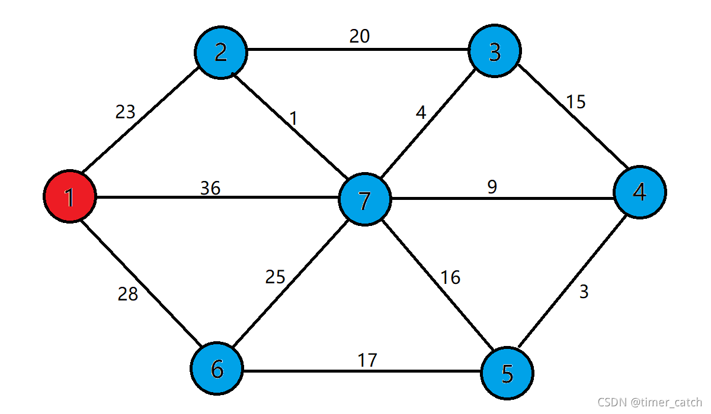
>
> 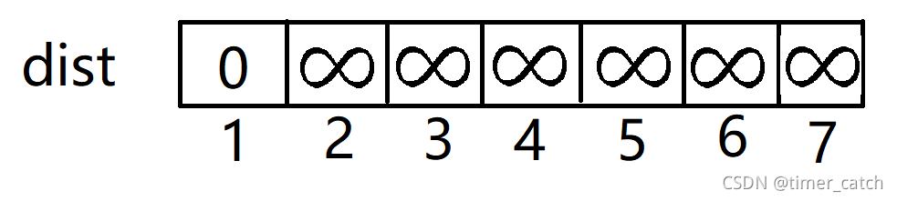
>
> 通过点1，对相邻点的dist进行更新，结果如下：
>
> 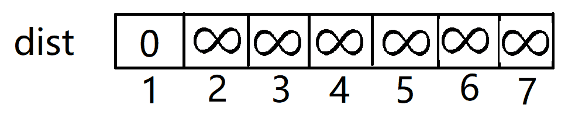
>
> 将与1最近的点2加入生成树中
>
> 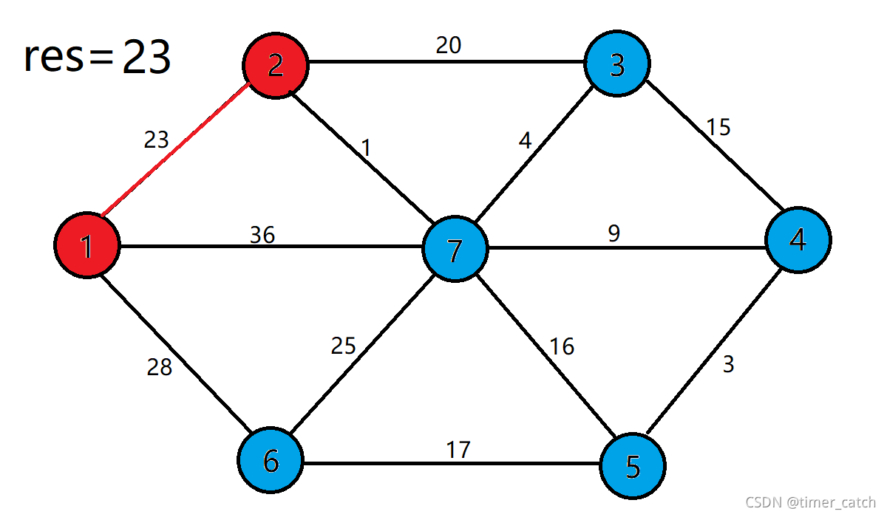
>
> 此时用2来更新dist数组
>
> 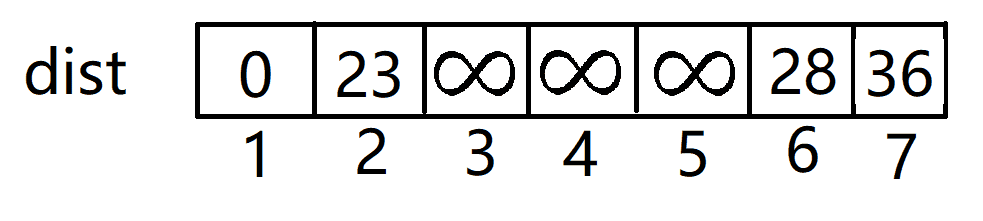
>
> 重复上述步骤，直到所有的点都加入到最小生成树中
>
> 
>
> 
>
> 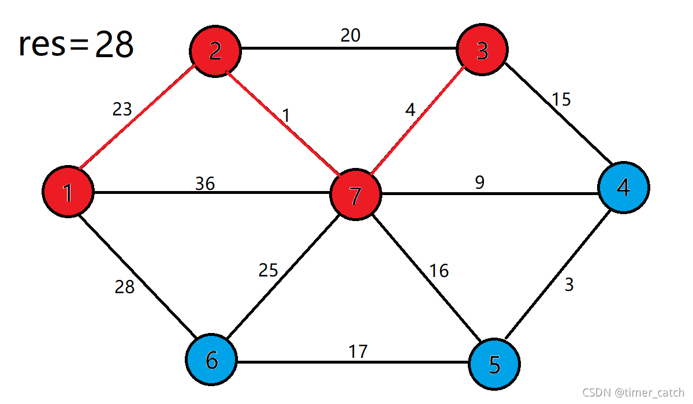
>
> 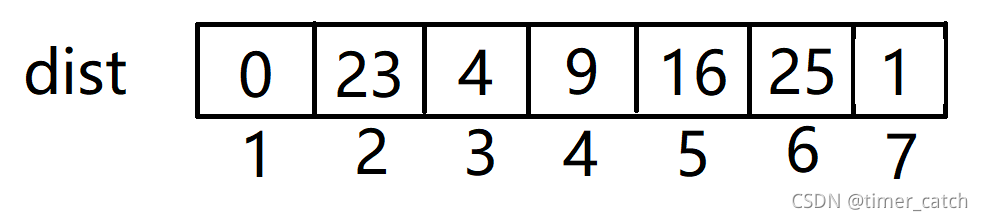
>
> 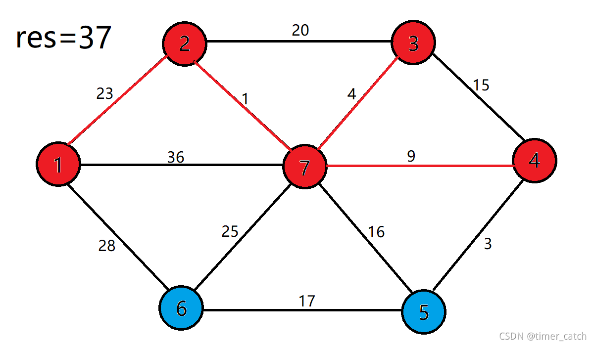
>
> 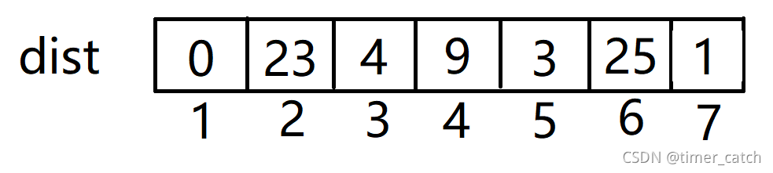
>
> 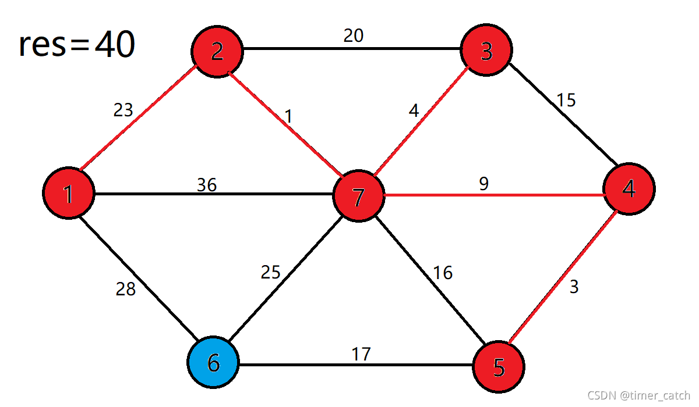
>
> 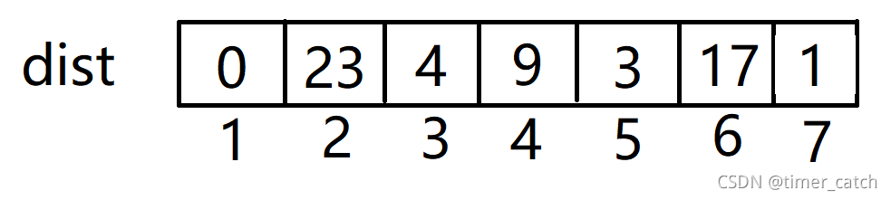
>
> 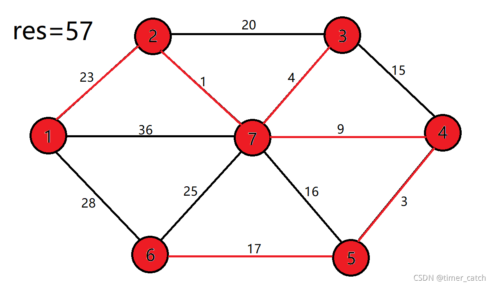

##### Kruskal

```cpp
int n, m;
std::cin >> n >> m;
std::vector<int> f(n + 5);
std::vector<std::array<int, 3>> e;
for(int i = 1;i <= n;i++)f[i] = i;
for(int i = 1;i <= m;i++){
  int x, y, val;
  std::cin >> x >> y >> val;
  //若存在x->y的单向边
  e.push_back({x, y, val});
  //若存在y->x的单向边
  e.push_back({y, x, val});
}
auto Kruskal = [&]() -> int{
  DSU dsu(n);
  int ans = 0, cc = 0;
  std::sort(e.begin(), e.end(), [&](const std::array<int, 3> &x, const std::array<int, 3> &y) -> bool{
    return x[2] < y[2];
  });//按照边权从小到大排序
  for(auto [u, v, val] : e){
    if(!dsu.same(u, v)){
      dsu.merge(u, v);
      ans += val;
      cc++;
      if(cc == n - 1)break;//如果加入了n-1个点，则表示联通了n个点，此时已经完成最小生成树的构建
    }
  }
  return ans;
};
std::cout << Kruskal() << endl;
return awa;
```

> [dsu详解点此处](#dsu)，此处展示dsu封装的模板
>
> ```cpp
> class DSU{
> private:
> 	int n;
> 	std::vector<int> f, sz;
> public:
> 	DSU(int x){
> 		n = x;
> 		f.resize(n + 5);
> 		sz.resize(n + 5, 1);
> 		for(int i = 1;i <= n;i++)f[i] = i;
> 	}
> 	
> 	int find(int x){
> 		if(f[x] != x)f[x] = find(f[x]);
> 		return f[x];
> 	}
> 	//合并x y
> 	void merge(int x, int y){
> 		int cx = find(x), cy = find(y);
> 		f[cy] = cx;
> 		sz[cy] += sz[cx];
> 	}
> 	//判断x y是否属于一个联通块
> 	bool same(int x, int y){
> 		return find(x) == find(y);
> 	}
> 	//判断某个联通块有几个节点
> 	int get_size(int x){
> 		return sz[x];
> 	}
> };
> ```


#### 单源最短路

> 若不含负权边，则优先使用Dijkstra（时间复杂度O((n+m)logm)，因为有些题目会构造使spfa超时的算法
>
> 若需要检测负权环，则使用Bellman-Ford（时间复杂度O(VE))，其中V为点数，E为边数
>
> 若含负权边且不需要检测负权环，则使用SPFA（最好时间复杂度O(V+E)，最坏O(VE)）

<span id="Dijkstra"></span>

##### Dijkstra

> 只适用于不含**负权边**的图
>
> 例题：[P4779 【模板】单源最短路径（标准版）](https://www.luogu.com.cn/problem/P4779)

```cpp
//注意此处使用了优先队列，想要元素从小到大排，重载运算符要**从大到小**，因为堆的性质（可以自行了解）！！
class cmp{
public:
	bool operator()(const PII &x, const PII &y) const {
		return x.second > y.second;
	}
};

//此处使用链式前向星建图
struct edge{
	int to, val, next;
};

int cnt = 0;
std::vector<edge> e(m + 5);
std::vector<int> head(n + 5, -1), dis(n + 5, 1e9), vis(n + 5);

auto add = [&](int u, int v, int val) -> void{
	e[cnt].next = head[u];
	e[cnt].to = v;
	e[cnt].val = val;
	head[u] = cnt++;
};
//此处有m条u->v，边权为dis的单向边
for(int i = 1;i <= m;i++){
  int u, v, dis;
  std::cin >> u >> v >> dis;
  add(u, v, dis);
}
//以下为Dijkstra，s为源点
auto Dijkstra = [&]() -> void{
  std::priority_queue<PII, std::vector<PII>, cmp> q;
  q.push({s, 0});//PII中存的为{u, dis}，u代表当前点，dis代表源点到此点的距离
  dis[s] = 0;
  while(!q.empty()){
    PII x = q.top();
    auto [u, val] = x;
    q.pop();
    if(vis[u])continue;
    vis[u] = 1;
    for(int i = head[u]; ~i; i = e[i].next){
      int v = e[i].to;
      if(dis[v] > dis[u] + e[i].val){
        dis[v] = dis[u] + e[i].val;
        if(!vis[v])q.push({v, dis[v]});
      }
    }
  }
  //最终每个点i距离源点s的距离都为dis[i]，若无法到达则距离为1e9
};
```


<span id="SPFA"></span>

##### SPFA

> 适用于**稀疏图，无负权环的图或者动态图**，例如**需要频繁更新最短路径的场景（网络路由）**
>
> 最坏时间复杂度为O(V*E)
>
> 例题：[P3371 【模板】单源最短路径（弱化版）](https://www.luogu.com.cn/problem/P3371)
>
> [P3385 【模板】负环](https://www.luogu.com.cn/problem/P3385)

```cpp
int n, m, s, cnt = 0;
std::cin >> n >> m >> s;
std::vector<edge> e(m + 5);
std::vector<int> vis(n + 5), head(n + 5, -1), dis(n + 5, 1e9), count(n + 5);
//此处以链式前向星存图
auto add = [&](int u, int v, int val) -> void{
	e[cnt].next = head[u];
	e[cnt].to = v;
	e[cnt].val = val;
	head[u] = cnt++;
};
for(int i = 1;i <= m;i++){
	int u, v, w;
	std::cin >> u >> v >> w;
  //此处为u->v的单向边，且权值为w
	add(u, v, w);
}
auto SPFA = [&]() -> bool{
	dis[s] = 0;//s为源点
	std::queue<int> q;
	q.push(s);
	vis[s] = 1;//标记s已经入队
	while(!q.empty()){
		int u = q.front();
		q.pop();
		vis[u] = false;//标记其出队
		for(int i = head[u]; ~i; i = e[i].next){
			int v = e[i].to, val = e[i].val;
			if(dis[v] > dis[u] + val){
				dis[v] = dis[u] + val;
				if(!vis[v]){//若没入队
					vis[v] = 1;//让其入队
					count[v]++;//记录其入队的次数
					if(count[v] > n)return false;//若入队次数>n，则存在负权环，返回false
					q.push(v);
				}
			}
		}
	}
	return true;//若返回true，则表示图中不存在负权环
};
SPFA();
//最终源点到每个点的距离存在dis数组中，若无法到达，则为1e9
```


##### Bellman-Ford

> 适用于**稠密图且V(顶点数)较小的情况**，需要**检测负权环**的场景
>
> 最坏时间复杂度为O(V*E)


#### 全源最短路

##### Floyd

> 时间复杂度**O(n^3)**，适用于n<=500的情况，能够求所有点对(i, j)的最短路径

```cpp
int n, m;
std::cin >> n >> m;
std::vector<std::vector<int>> f(n + 5, std::vector<int>(n + 5, 1e9));//将距离值设为最大值
for(int i = 1;i <= m;i++){
	int u, v, w;
	std::cin >> u >> v >> w;
	f[u][v] = f[v][u] = std::min(f[u][v], w);//确保目前存下来的是u<->v的最短路
}
for(int i = 1;i <= n;i++)f[i][i] = 0;
//Floyd
for(int k = 1;k <= n;k++)
	for(int i = 1;i <= n;i++)
		for(int j = 1;j <= n;j++)
			f[i][j] = std::min(f[i][j], f[i][k] + f[k][j]);
//输出结果
for(int i = 1;i <= n;i++){
	for(int j = 1;j <= n;j++)std::cout << f[i][j] << " ";
	std::cout << endl;
}
```


<span id="Johnson"></span>

##### Johnson算法

> 时间复杂度$O(n^2m)$，通过Dijkstra优化后可以达到$O(nm\ log\ m)$
>
> 例题：[P5905 【模板】全源最短路（Johnson）](https://www.luogu.com.cn/problem/P5905)

Johnson算法通过新建一个虚拟节点（此处设它的编号为0），从这个点向其他所有点连一条边权为 0 的边。

接下来用 Bellman-Ford 算法求出 0 号点到其他所有路的最短路，记为 $h_i$ 。

假如存在一条从 $u$ 点到 $v$ 点，边权为 $w$ 的边，则我们将该边的边权重新设置为 $w+h_u-h_v$

接下来以每个点为起点，跑 $n$ 轮 Dijkstra 算法即可求出任意两点间的最短路了。

注意最后的答案为 $dis[u][v] - h[u] + h[v]$ 即由加权值得到原来的值


**正确性证明**

Johnson算法用到的 $h$ 数组，实际上类似于物理概念上的**势能**

诸如重力势能，电势能这样的势能都有一个特点：势能的变化量只和起点和终点的**相对位置**有关，而与起点到终点所走的路径无关。且势能的绝对值往往取决于设置的零势能点，但无论**零势能点设置在哪里，两点间势能的差值是一定的。**

对于处理的图中，假设有一条从 $s$ 到 $t$ 的路径 $s \rightarrow p_1 \rightarrow p_2 \rightarrow \cdots \rightarrow p_k \rightarrow t$ ，其长度表达式如下：
$$
(w(s, p_1) + h_s - h_{p_1}) + (w(p_1, p_2) + h_{p_1} - h_{p_2}) + \cdots + (w(p_k, t) + h_{p_k} - h_t)
$$
化简后得到：
$$
w(s, p_1) + w(p_1, p_2) + \cdots + w(p_k, t) + h_s - h_t
$$
无论从 $s$ 到 $t$ 走的是那种路径，$h_s - h_t$ 的值是不变的，与势能的性质相吻合

为了方便，我们将 $h_i$ 称为 $i$ 点的势能

上面的表达式
$$
w(u, v) + h_u - h_v \ (u, v \in V)
$$
前半部分为原图中 $u \rightarrow v$ 的最短路，后半分为两点间的势能差。又两点间势能差为定值，因此原图上 $u \rightarrow v$ 的最短路和新图上 $u \rightarrow v$ 的最短路相对应。

新图上任意一边 $(u, v)$ 上两点满足 $h_v \leq h_u + w(u, v)$，这条边重新标记后的边权为
$$
 w^{'}(u, v) = w(u, v) + h_u - h_v \geq 0 
$$
这样构建的新图上边权都不为负


**模板**

```cpp
//此处使用链式前向星存图
struct edge{
    int from, to, next, val;
};
//此处是重载运算符
class cmp{
public:    
  bool operator()(const PII &x, const PII &y){  
    return x.second > y.second;    
    //因为重载的是堆，所以比较函数要从大到小，这样输出的结果为从小到大    
  }
};
int n, m;    
std::cin >> n >> m;
std::vector<edge> e(n + m + 5); //预留空间（原边+虚拟节点边） 
//count为spfa入队次数，h为势能，vis为spfa是否已入队
std::vector<int> head(n + 5, -1), h(n + 5, 1e9), count(n + 5), vis(n + 5);
//u->v的最短路
std::vector<std::vector<int>> dis(n + 5, std::vector<int>(n + 5, 1e9));
int cnt = 0;
//链式前向星添加边
auto add = [&](int u, int v, int val) -> void{
  e[cnt].from = u;  
  e[cnt].to = v;  
  e[cnt].next = head[u];  
  e[cnt].val = val;  
  head[u] = cnt++;  
};
for(int i = 1;i <= m;i++){
  int u, v, w;  
  std::cin >> u >> v >> w;  
  //存在u->v的单向边，边权为w
  add(u, v, w);  
}
//添加虚拟节点0，并且建边0->i，边权为0
for(int i = 1;i <= n;i++)
  add(0, i, 0);
//spfa处理势能
auto spfa = [&]() -> bool{        
  std::queue<int> q;        
  q.push(0);        
  h[0] = 0;//初始化势能       
  while(!q.empty()){  
    int u = q.front();    
    q.pop();    
    vis[u] = 0;    
    for(int i = head[u]; ~i; i = e[i].next){    
      int v = e[i].to, val = e[i].val;      
      if(h[v] > h[u] + val){      
        h[v] = h[u] + val;        
        if(!vis[v]){        
          q.push(v);          
          vis[v] = 1;          
          count[v]++;          
          //点有n+1个，若入队超过n+1次，则存在负环，返回false       
          if(count[v] > n + 1)return false;          
        }        
      }      
    }    
  }
  return true;  
};
if(!spfa()){//若存在负环，直接输出-1
  std::cout << -1 << endl;       
  return awa;  
}
for(int i = 0;i < cnt;i++){        
  auto &[u, v, next, val] = e[i];  
  if(u)//虚拟节点的边不需要调整，虽然调整了也没关系  
    val += h[u] - h[v];//调整边权   
}
//跑n遍dijkstra，当前以u为源点
auto dijkstra = [&](int u) -> void{
  //此处pair存的是 u dis，即 点 距离  
  std::priority_queue<PII, std::vector<PII>, cmp> q;  
  dis[u][u] = 0;  
  q.push({u, 0});  
  while(!q.empty()){  
    auto [p, cur] = q.top();    
    q.pop();    
    //若当前距离比之前的最短路更长，或者当前处理的是虚拟节点，则跳过    
    if(cur > dis[u][p] || !p) continue;    
    for(int i = head[p]; ~i; i = e[i].next){    
      int v = e[i].to, val = e[i].val;      
      if(dis[u][v] > dis[u][p] + val){      
        dis[u][v] = dis[u][p] + val;        
        q.push({v, dis[u][v]});        
      }      
    }    
  }  
};
//跑n遍dijkstra
for(int i = 1;i <= n;i++)
  dijkstra(i);
//最终u, v的答案为 dis[i][j] - h[i] + h[j]
```


#### 最近公共祖先(LCA)

> 例题：[P3379 【模板】最近公共祖先（LCA）](https://www.luogu.com.cn/problem/P3379)

##### 倍增法求LCA

> 适用于**实时查询，多次动态查询**，时间复杂度为预处理O(n log n)，查询O(logn)

```cpp
//此处使用链式前向星建边
struct edge{
	int next, to;
};
int n, m, s, cnt = 0;
std::cin >> n >> m >> s;//s为树根编号
std::vector<edge> e(n * 2 + 5);//双向边所以要两倍空间
std::vector<int> head(n + 5, -1), dep(n + 5);
std::vector<std::vector<int>> f(n + 5, std::vector<int>(20));
//此处因为n<=500000,2^19=524288>500000,所以此处f的第二维大小为20(0~19)
//请根据题目范围调整f的大小
auto add = [&](int x, int y) -> void{
	e[cnt].next = head[x];
	e[cnt].to = y;
	head[x] = cnt++;
};
for(int i = 1;i < n;i++){
	int x, y;
	std::cin >> x >> y;
  //添加x<->y的双向边
	add(x, y);
	add(y, x);
}
//使用dfs求深度dep
std::function<void(int, int)>dfs = [&](int u, int fa) -> void{
	dep[u] = dep[fa] + 1;//当前深度等于父亲节点的深度+1
	f[u][0] = fa;//向上跳2^0=1个深度为fa
	for(int i = 1;(1ll << i) <= dep[u];i++)
		f[u][i] = f[f[u][i - 1]][i - 1];//向上跳2^(i-1)层的结点，再向上跳2^(i-1)层，即为2^i层
	for(int i = head[u]; ~i; i = e[i].next)
		if(e[i].to != fa)//往下继续dfs操作，防止回到fa
			dfs(e[i].to, u);
};
dfs(s, 0);//设立一个虚假的“根结点0”，让真正的根结点s深度为1

auto lca = [&](int x, int y) -> int{
	if(dep[x] < dep[y])std::swap(x, y);//把更深的结点放在前面
	int tmp = dep[x] - dep[y];//求深度差
	for(int i = 0; (1ll << i) <= tmp; i++)
		if((1ll << i) & tmp)
			x = f[x][i];//一直向上跳，知道x与y同层
	if(x == y)return x;//如果同层的时候两者一样，则当前结点为之前结点的最近公共祖先
	for(int i = int(log(n) / log(2)); i >= 0; i--)
		if(f[x][i] != f[y][i]){//一起向上跳直到两个点的父亲是一样的
			x = f[x][i];
			y = f[y][i];
		}
	return f[x][0];//此时两个结点的父亲是一样的，返回时为最近公共祖先
};
for(int i = 1;i <= m;i++){
	int x, y;
	std::cin >> x >> y;
	std::cout << lca(x, y) << endl;
}
```


##### Tarjan求LCA

> 适用于**已知所有查询的批量处理**，时间复杂度为O(n + q)

```cpp
int n, m, s;
std::cin >> n >> m >> s;
//此处使用邻接表建边，ans表示第i次查询的结果，vis表示某个点是否被访问过
std::vector<int> e[n + 5], ans(m + 5), vis(n + 5);
//此处存的是query
std::vector<PII> q[n + 5];
DSU dsu(n);
for(int i = 1;i < n;i++){
	int x, y;
	std::cin >> x >> y;
	e[x].push_back(y);
	e[y].push_back(x);
}
for(int i = 1;i <= m;i++){
	int x, y;
	std::cin >> x >> y;
	if(x == y) ans[i] = x;
	else{
		//存的query数组，这里的i代表的是第i次查询
		q[x].push_back({y, i});
		q[y].push_back({x, i});
	}
}

std::function<void(int, int)> tarjan = [&](int u, int fa) -> void{
	vis[u] = 1;//标记当前点已经被访问过
	for(int v : e[u]){
		if(v == fa)continue;
		tarjan(v, u);
    //将子结点合并到当前结点集合
    //注意merge顺序是u合并v，保证父节点正确性！！
		dsu.merge(u, v);
	}
	for(auto [v, idx] : q[u])
		if(vis[v])//当另一个结点被访问过时
      //当前集合的根即为LCA（因为合并方向时向上合并）
			ans[idx] = dsu.find(v);
};

tarjan(s, -1);
for(int i = 1;i <= m;i++)
	std::cout << ans[i] << endl;
```


#### 网络流

> 请先了解[网络](#network)


##### 最大流

> 对于网络来讲，合法的流函数有很多，其中使得整个网络流量之和最大的流函数称为网络的**最大流**，此时的流量和被称为网络的**最大流量**
>
> 例题：[P3376 【模板】网络最大流](https://www.luogu.com.cn/problem/P3376)
>
> [P2740 [USACO4.2] 草地排水Drainage Ditches](https://www.luogu.com.cn/problem/P2740)
>
> 对于稀疏图，使用EK算法更优（时间复杂度$O(nm^2)$），对于稠密图，使用Dinic算法更优（时间复杂度$O(n^2m)$）


###### Edmonds - Karp增广路算法（EK算法）

> 时间复杂度为$O(nm^2)$

思想就是不断用BFS寻找增广路并不断更新最大流量值，直到网络上不存在增广路为止，并且会将**无向图**的每条边拆成**两条方向相反的单向边**

> 此处的增广路定义为，若一条从S到T的路径上**所有边的剩余容量都大于0**，则这样的路径为增广路
>
> 在BFS寻找一条增广路时，我们只需要考虑**剩余流量不为0**的边，然后找到一条从$S$到$T$的路径，同时计算出路径上**各边剩余容量值的最小值dis**，则网络的最大流量就可以增加dis（经过的正向边容量值全部剪去dis，反向边全部加上dis）


**为什么要建反向边？**

因为可能**一条边可以被包含于多条增广路**，所以为了寻找所有的增广路径我们就要让这一条边有**多次被选择的机会**，相当于给程序一次**反悔**的机会


**使用“成对存储”**

将正向边存在**0和1**，**2和3**，**4和5......**

这样存储能够使用**xor1**的方式找到对应的正向边和反向边


**模板**

```cpp
//此处使用链式前向星建图
struct edge{
    int next, to, val;
};
//n个点，m条边，s为源点，t为汇点，答案为ans
int n, m, s, t, cnt = 0, ans = 0;
std::cin >> n >> m >> s >> t;
//flow是每个点的流量，pre是前驱
std::vector<int> head(n + 5, -1), flow(n + 5), pre(n + 5);
std::vector<edge> e(2 * m + 5);//拆成方向相反的两条边，所以空间要两倍
std::vector<std::vector<int>> vis(n + 5, std::vector<int>(n + 5, -1));//处理重边的情况
//链星建图过程
auto add = [&](int u, int v, int val) -> void{
  e[cnt].to = v;
	e[cnt].next = head[u];
  e[cnt].val = val;
  vis[u][v] = cnt;//记录一下，处理重边的情况
  head[u] = cnt++;
};
for(int i = 1;i <= m;i++){
  int u, v, w;
  std::cin >> u >> v >> w;
  if(vis[u][v] == -1){//若没建过边，则存图
    add(u, v, w);
    add(v, u, 0);//注意反向边刚开始的最大容量为0
  }else{//若建过边，则最大容量相加
    e[vis[u][v]].val += w;//注意不需要给反向边加
  }
}
//bfs求增广路过程
auto bfs = [&]() -> int{
  std::vector<int> vis(n + 5);
	std::queue<int> q;
	q.push(s);
	vis[s] = 1;
	flow[s] = 1e9;
	while(!q.empty()){
		int u = q.front();
    q.pop();
		for(int i = head[u]; ~i; i = e[i].next){
      if(!e[i].val)continue;//我们只关心剩余流量不为0的边
      int v = e[i].to, val = e[i].val;
      if(vis[v])continue;//若这一条增广路已经被访问过，则跳过
      flow[v] = std::min(flow[u], val);//流量为这条边的最大流量 和 前一个点的流量 的 最小值
      pre[v] = i; //记录前驱，方便修改边权    
      q.push(v);   
      vis[v] = 1; 
      if(v == t) return 1;//成功找到增广路            
    }   
  }        
  return 0;    
};
//更新所经过边的正向边权和反向边权
auto update = [&]() -> void{        
  int u = t;        
  while(u != s){            
    int v = pre[u];//找前驱            
    e[v].val -= flow[t];//当前边能容纳的容量减小            
    e[v ^ 1].val += flow[t];//反向边容纳的容量增大            
    u = e[v ^ 1].to;//继续走前面的点
    //反向边要去的点即位前面的点        
  }        
  ans += flow[t];//答案为每一条增广路的最小流量值之和    
};
while(bfs())update();//直到网络中不存在增广路
std::cout << ans << endl;
```


###### Dinic算法

> 时间复杂度$O(n^2m)$

需要将**无向图**的每条边拆成**两条方向相反的单向边**

EK算法**每次都会遍历整个残量网络**，但**只找出一条增广路**，能否一次找多条增广路呢？Dinic算法使用了分层图&DFS来实现同时求出多条增广路的需求

> 分层图为一张**有向无环图**，设从$S$到x最少需要经过的边数为它的**层次**，用$d[x]$表示，那么在残量网络中，满足$d[y]=d[x]+1$的边$(x,y)$构成的子图被称为**分层图**

**当前弧优化**

在传统DFS中，每次访问节点时都会从头到尾遍历表。但某些边可能在之前的搜索中已经耗尽了容量（即剩余流量为0），重复检查这些边会浪费时间。当前弧优化通过记录每个节点**当前应检查的边**，跳过无效边，从而减少冗余操作。


**为什么要建反向边？**

因为可能**一条边可以被包含于多条增广路**，所以为了寻找所有的增广路径我们就要让这一条边有**多次被选择的机会**，相当于给程序一次**反悔**的机会


**使用“成对存储”**

将正向边存在**0和1**，**2和3**，**4和5......**

这样存储能够使用**xor1**的方式找到对应的正向边和反向边


**模板**

```cpp
//此处使用链式前向星建图
struct edge{
    int next, to, val;
};
//n个点，m条边，s为源点，t为汇点，答案为ans
int n, m, s, t, cnt = 0, ans = 0;
std::cin >> n >> m >> s >> t;
//dep是每个点的深度，now是当前弧优化
std::vector<int> head(n + 5, -1), dep(n + 5), now(n + 5);
std::vector<edge> e(2 * m + 5);//拆成方向相反的两条边，所以空间要两倍
//链星建图过程
auto add = [&](int u, int v, int val) -> void{
  e[cnt].to = v;
	e[cnt].next = head[u];
  e[cnt].val = val;
  head[u] = cnt++;
};
for(int i = 1;i <= m;i++){
  int u, v, w;
  std::cin >> u >> v >> w;
  add(u, v, w);
  add(v, u, 0);
}
//在残量网络中构造分层图    
auto bfs = [&]() -> int{        
  for(int i = 1;i <= n;i++)dep[i] = 1e9;        
  std::queue<int> q;        
  q.push(s);        
  dep[s] = 0;        
  now[s] = head[s];//初始化当前弧为u头指针       
  while(!q.empty()){            
    int u = q.front();            
    q.pop();           
    for(int i = head[u]; ~i; i = e[i].next){                
      int v = e[i].to, val = e[i].val;                
      //若有剩余容量且v未被分层                
      if(val > 0 && dep[v] == 1e9){                    
        q.push(v);                    
        now[v] = head[v];//初始化v得当前弧                    
        dep[v] = dep[u] + 1;//层次+1                    
        if(v == t) return 1;//到达汇点则构建成功                
      }            
    }        
  }        
  return 0;    
};
std::function<int(int, int)> dfs = [&](int u, int flow) -> int{        
  if(u == t) return flow; //到达汇点，返回可推送的流量       
  int k, res = 0;//k为单条路径流量，res为累积流量        
  //如果还有流量        
  for(int i = now[u]; ~i && flow; i = e[i].next){            
    now[u] = i; //更新当前弧指针            
    int v = e[i].to, val = e[i].val;            
    //若这个点在我下一层，且边还有剩余流量            
    if(val > 0 && (dep[v] == dep[u] + 1)){             
      k = dfs(v, std::min(flow, e[i].val));      
      if(!k)dep[v] = 1e9; //剪枝：若节点无法到达汇点      
      e[i].val -= k; //更新正向边剩余容量      
      e[i ^ 1].val += k; //更新反向边剩余容量        
      res += k; //累加该节点输出的总流量               
      flow -= k; //减少剩余需要推送的流量            
    }       
  }        
  return res;   
};    
//每次BFS分层后DFS多路增广    
while(bfs())        
  ans += dfs(s, 1e9);//从源点推送无限流量（实际上首先于边容量）    
std::cout << ans << endl;
```


##### 最小费用最大流

> 例题：[P3381 【模板】最小费用最大流](https://www.luogu.com.cn/problem/P3381)

给定网络$D=(V, E, C)$，每一条弧$(v_i, v_j)$上，除了已经给的最大容量$C_{ij}$以外，还给了一个单位流量的费用$cost(v_i, v_j) \geq 0$。最小费用最大流问题即先保证**最大流 $f$ **的前提下，流的**总输送费用最小**


###### SPFA+EK实现

```cpp
//此处使用链式前向星建图
struct edge{
    int next, to, flow, cost;
};
//n个点，m条边，s为源点，t为汇点，最大流为maxFlow，最小花费为minCost
int n, m, s, t, cnt = 0, maxFlow = 0, minCost = 0;    
std::cin >> n >> m >> s >> t;    
//flow是每个点的流量，pre是前驱，cost是花费 
std::vector<int> head(n + 5, -1), flow(n + 5), pre(n + 5), cost(n + 5), vis(n + 5);
std::vector<edge> e(2 * m + 5);//拆成方向相反的两条边，所以空间要两倍    
//链星建图过程    
auto add = [&](int u, int v, int flow, int cost) -> void{        
  e[cnt].to = v;        
  e[cnt].next = head[u];        
  e[cnt].flow = flow;        
  e[cnt].cost = cost;       
  head[u] = cnt++;    
};    
for(int i = 1;i <= m;i++){        
  int u, v, w, c;        
  std::cin >> u >> v >> w >> c;        
  add(u, v, w, c);        
  add(v, u, 0, -c);//注意反向边刚开始的最大容量为0，花费为-c    
}    
//spfa求增广路   
auto spfa = [&]() -> bool{    
  for(int i = 1;i <= n;i++)cost[i] = 1e18;  
  std::queue<int> q;  
  q.push(s);  
  cost[s] = 0;//初始化源点花费为0  
  flow[s] = 1e18;//初始化源点为无限流量（实际上受其他边限制）  
  pre[t] = -1;//初始化汇点的前驱为-1  
  while(!q.empty()){  
    int u = q.front();    
    q.pop();    
    vis[u] = 0;    
    for(int i = head[u]; ~i; i = e[i].next){    
      int v = e[i].to;      
      //如果还有剩余容量，并且存在更短路      
      if(e[i].flow > 0 && cost[v] > cost[u] + e[i].cost){      
        cost[v] = cost[u] + e[i].cost;//更新花费数组        
        pre[v] = i;//更新前驱        
        flow[v] = std::min(flow[u], e[i].flow);//更新剩余容量        
        if(!vis[v]){        
          vis[v] = 1;          
          q.push(v);          
        }        
      }      
    }    
  }  
  return pre[t] != -1;//若汇点前驱不为-1，则找到了增广路
};
//最小费用最大流
auto MCMF = [&]() -> void{
  while(spfa()){  
    int u = t;    
    maxFlow += flow[t];    
    minCost += flow[t] * cost[t];    
    while(u != s){    
      int v = pre[u];//找前驱                  
      e[v].flow -= flow[t];//当前边能容纳的容量减小                  
      e[v ^ 1].flow += flow[t];//反向边容纳的容量增大                  
      u = e[v ^ 1].to;//继续走前面的点      
      //反向边要去的点即位前面的点      
    }    
  } 
};
MCMF();
std::cout << maxFlow << " " << minCost << endl;
```


###### Dijkstra+EK实现

[Dijkstra算法](#Dijkstra)无法处理**负权边**，那么网络流进行拆边的时候，会出现负边，直接使用Dijkstra会失效。那么受到[Johnson算法](#Johnson)的启发，我们可以通过调整边权消除负权边，同时保证最短路径的相对关系不变。

> 要是不理解这里，请自行跳转 **全源最短路 Johnson算法** 处进行学习

初始势能计算：

使用[SPFA算法](#SPFA)预处理出初始势能数组$h$，其中$h[u]$表示从源点$s$到节点$u$的最短路径费用。此时，所有边的调整后费用为：
$$
adjusted\_cost(u \rightarrow v) = cost(u \rightarrow v) + h[u] - h[v]
$$
每次通过Dijkstra找到增广路径后，更新势能数组：
$$
h[u] = h[u] + dis[u]
$$
其中$dis[u]$是当前调整后的费用下的最短距离，这保证后续边权调整后仍为负。


**模板**

```cpp
//此处使用链式前向星存图
struct edge{
    int to, next, flow, cost;
};
//此处是重载运算符
class cmp{
public:    
    bool operator()(const PII &x, const PII &y){  
        return x.second > y.second;    
        //因为重载的是堆，所以比较函数要从大到小，这样输出的结果为从小到大    
    }
};
//n个点，m条边，源点为s，汇点为t，最小花费为minCost，最大流为maxFlow    
int n, m, s, t, minCost = 0, maxFlow = 0, cnt = 0;
std::cin >> n >> m >> s >> t;
//h为势能，pre为前驱
std::vector<int> head(n + 5, -1), h(n + 5), pre(n + 5);
std::vector<edge> e(2 * m + 5);
auto add = [&](int u, int v, int flow, int cost) -> void{
  e[cnt].to = v;  
  e[cnt].next = head[u];  
  e[cnt].flow = flow;  
  e[cnt].cost = cost;  
  head[u] = cnt++;  
};
for(int i = 1;i <= m;i++){
  int u, v, w, c;  
  std::cin >> u >> v >> w >> c;  
  add(u, v, w, c);  
  add(v, u, 0, -c);//注意反向边  
}
auto MCMF = [&]() -> void{        
  while(1){  
    //此处的PII存放的是{u, dis}，即{点，距离}    
    std::priority_queue<PII, std::vector<PII>, cmp> q;    
    //cost为花费数组，vis为是否已经走过    
    std::vector<int> cost(n + 5, 1e9), vis(n + 5);    
    cost[s] = 0;    
    q.push({s, 0});    
    //Dijkstra过程    
    while(!q.empty()){    
      auto [u, c] = q.top();      
      q.pop();      
      vis[u] = 1;      
      for(int i = head[u]; ~i; i = e[i].next){      
        //此处的val是加上势能后的边权        
        int v = e[i].to, val = e[i].cost + h[u] - h[v];        
        //如果还有剩余容量，并且当前花费大于之前的花费加上 加上势能后的边权        
        if(e[i].flow > 0 && cost[v] > c + val){        
          cost[v] = c + val;//更新cost数组          
          pre[v] = i;//记录前驱          
          q.push({v, cost[v]});          
        }        
      }      
    }    
    //若没有到达汇点，则表示没有残量网络，退出函数    
    if(cost[t] == 1e9) return ;    
    //更新势能    
    for(int i = 1; i <= n; i++)    
      if(cost[i] != 1e9)h[i] += cost[i];      
    //计算增广流量    
    int curFlow = 1e9;    
    for(int u = t; u != s; u = e[pre[u] ^ 1].to)    
      curFlow = std::min(curFlow, e[pre[u]].flow);
    //更新最大流和最小花费
    maxFlow += curFlow;    
    minCost += curFlow * h[t]; //此处的h[t]已经包含了调整后的总费用    
    //更新网络    
    for(int u = t; u != s; u = e[pre[u] ^ 1].to){    
      e[pre[u]].flow -= curFlow;      
      e[pre[u] ^ 1].flow += curFlow;      
    }    
  }   
};
MCMF();
std::cout << maxFlow << " " << minCost << endl;
```


### 数据结构

<span id = "dsu"></span>

#### 并查集

> 例题：[P1536 村村通](https://www.luogu.com.cn/problem/P1536)

```cpp
class DSU{
private:
	int n;
	std::vector<int> f, sz;
public:
	DSU(int x){
		n = x;
		f.resize(n + 5);
		sz.resize(n + 5, 1);
		for(int i = 1;i <= n;i++)f[i] = i;
	}
	
	int find(int x){
		if(f[x] != x)f[x] = find(f[x]);
		return f[x];
	}
	//合并x y
	void merge(int x, int y){
		int cx = find(x), cy = find(y);
		f[cy] = cx;
		sz[cy] += sz[cx];
	}
	//判断x y是否属于一个联通块
	bool same(int x, int y){
		return find(x) == find(y);
	}
	//判断某个联通块有几个节点
	int get_size(int x){
		return sz[x];
	}
};
```


#### 线段树

<span id="SegmentTree"></span>

##### SegmentTree（不带LazyTag）

###### Ice's线段树模板使用注意事项

<span id="SegmentTree_notice"></span>

注意此线段树下标**从1开始(1-based)**，并且**操作区间为左闭右闭区间**！！！

有两种构造方式，方式一为直接指定大小

```cpp
SegmentTree<Info> sgt(n);
```

调用的构造函数原型为

```cpp
SegmentTree(int _n, Info _v = Info()){
	init(_n, _v);
}
```

方式二为传入初始化数组以及大小（初始化数组长度任意，但是**一定要保证数据存在1-n！！**

```cpp
std::vector<Info> a(n + 5);
for(int i = 1;i <= n;i++)
  //此处对a进行输入
SegmentTree<Info> sgt(n, a);
```

调用的构造函数原型为

```cpp
template<class T>
SegmentTree(int _n, std::vector<T> _init){
	init(_n, _init);
}
```

init函数为

```cpp
template<class T>
void init(int _n, std::vector<T> _init){
	n = _n;
	info.resize(4 * n + 5, Info());

	std::function<void(int, int, int)>build = [&](int k, int l, int r) -> void{
		if(l == r){
			info[k] = _init[l];
			return ;
		}
		int mid = (l + r) >> 1;
		build(lc(k), l, mid);
		build(rc(k), mid + 1, r);
		pushup(k);
	};

	build(1, 1, n);
}
```

上述两种方法传入的第一个参数都为n，指的是线段树处理的区间是**1～n**


###### 线段树模板

```cpp
template<class Info>
class SegmentTree{
	#define lc(x) (x << 1)
	#define rc(x) (x << 1 | 1)
private:
	int n;
	std::vector<Info> info;
public:
	SegmentTree(int _n, Info _v = Info()){
		init(_n, _v);
	}

	template<class T>
	SegmentTree(int _n, std::vector<T> _init){
		init(_n, _init);
	}

	//若_init大小为n+5，则需要传入题目长度n，以及_init
	template<class T>
	void init(int _n, std::vector<T> _init){
		n = _n;
		info.resize(4 * n + 5, Info());

		std::function<void(int, int, int)>build = [&](int k, int l, int r) -> void{
			if(l == r){
				info[k] = _init[l];
				return ;
			}
			int mid = (l + r) >> 1;
			build(lc(k), l, mid);
			build(rc(k), mid + 1, r);
			pushup(k);
		};

		build(1, 1, n);
	}

	//可以直接传入n的大小
	void init(int _n, Info _v = Info()){
		init(_n, std::vector<Info>(_n + 5, _v));
	}

	void pushup(int k){
		info[k] = info[lc(k)] + info[rc(k)];
	}

	void update(int k, int l, int r, int x, const Info &v){
		if(l == r){
			info[k] = v;
			return ;
		}
		int mid = (l + r) >> 1;
		if(x <= mid)update(lc(k), l, mid, x, v);
		else update(rc(k), mid + 1, r, x, v);
		pushup(k);
	}

	void update(int k, const Info &v){
		update(1, 1, n, k, v);
	}

	Info query(int k, int l, int r, int x, int y){
		if(l > y || r < x)return Info();
		if(x <= l && r <= y)return info[k];
		int mid = (l + r) >> 1;
		return query(lc(k), l, mid, x, y) + query(rc(k), mid + 1, r, x, y);
	}

	Info query(int l, int r){
		return query(1, 1, n, l, r);
	}

	#undef lc(k)
	#undef rc(k)
};

struct Info {
	//在此处存放变量
};

Info operator+(const Info &a, const Info &b){
	Info c;
  //在此处重载规则
  return c;
}
```

> 在使用此线段树前，请确保你已经看过了[Ice's线段树模板使用注意事项](#SegmentTree_notice)
>
> > 即此Tag的SegmentTree下面的灰色文字部分，这部分讲了此线段树初始化的方式以及传入的参数，并且说明了此线段树为**1-based**


###### Info类型变量的书写规则以及Info重载运算符的方法

Info结构体内定义的为你想要线段树能操作的变量，例如区间元素和sum，元素区间的最大值mx，区间最小值mn等

Info重载的运算符即你希望**pushup**的规则

例如常规线段树当中的

```cpp
struct Node{
  int sum, mx, mn;
}t[maxn * 4];
//....
void pushup(int k){
  t[k].sum = t[k << 1].sum + t[k << 1 | 1].sum;
  t[k].mx = std::max(t[k << 1].mx, t[k << 1 | 1].mx);
  t[k].mn = std::min(t[k << 1].mn, t[k << 1 | 1].mn);
}
```

在此板子中需要这样写：

```cpp
struct Info{
  int sum, mx, mn;
  Info(): sum(0), mx(0), mn(0) {}
  Info(int x): sum(x), mx(x), mn(x) {}
};

Info operator+(const Info &a, const Info &b){
  Info c;
  c.sum = a.sum + b.sum;
  c.mx = std::max(a.mx, b.mx);
  c.mn = std::min(a.mn, b.mn);
  return c;
}
```


###### update函数（单点修改）

<span id="segment_tree_update"></span>

其中，**update函数**为**单点**修改，有两种使用方式

第一种，直接指定需要操作的**下标x(1-based)**和需要**修改为的Info_val（不是相加，而是直接修改成）**

```cpp
SegmentTree<Info> sgt(n);
sgt.update(index, Info_val);
```

**如果想要相加，例如想要将index的值加上y，则需要如此操作：**

```cpp
struct Info{
  //....
  Info(int x = 0): x(x) {}
}
update(index, Info(a[index].val += val));
```

第二种，按照常规线段树的update，传入根，线段树左右区间，需要修改的下标，需要**修改为的Info_val**

```cpp
SegmentTree<Info> sgt(n);
sgt.update(1, 1, n, index, Info_val);
```

若想想加，则按照上面的方法进行操作


###### query函数（区间查询）

对于**query**函数，可以进行区间查询，有两种使用方式

第一种，直接指定需要查询的左右区间l，r，返回**Info类型变量**

```cpp
SegmentTree<Info> sgt(n);
Info ans = sgt.query(l, r);
```

第二种，按照常规线段树的query，传入根，线段树左右区间，需要查询的左右区间l，r，返回**Info类型变量**

```cpp
SegmentTree<Info> sgt(n);
Info ans = sgt.query(1, 1, n, l, r);
```


###### 使用示例

例如我需要修改单点的值，查询区间gcd以及区间和，示例为：

```cpp
struct Info {
	int x, d;
	Info(int x = 0) : x(x), d(x) {}
};
 
Info operator+(const Info &a, const Info &b){
	Info c;
	c.x = a.x + b.x;
	c.d = gcd(a.d, b.d);
	return c;
}
 
std::vector<Info> a(n + 5);
for(int i = 1;i <= n;i++){
	int x;
	std::cin >> x;
	a[i] = Info(x);
}
SegmentTree<Info> sgt(n, a);
while(m--){
//此处当opt为1时，向第x位的数字+y
//当opt为2时，查询[x, y]的gcd和元素和
	int opt, x, y;
	std::cin >> opt >> x >> y;
	if(opt == 1){
		sgt.update(x, Info(a[x].x += y));
	}else std::cout << sgt.query(x, y).x << " " << sgt.query(x, y).d << endl;
}
```


##### LazySegmentTree（带LazyTag）

###### Ice's懒标记线段树模板使用注意事项

<span id="Lazy_SegmentTree_notice"></span>

注意此线段树下标**从1开始(1-based)**，并且**操作区间为左闭右闭区间**！！！

有两种构造方式，方式一为直接指定大小

```cpp
LazySegmentTree<Info, Tag> lsgt(n);
```

调用的构造函数原型为

```cpp
LazySegmentTree(int _n, Info _v = Info()){
	init(_n, _v);
}
```

方式二为传入初始化数组以及大小（初始化数组长度任意，但是**一定要保证数据存在1-n！！**

```cpp
std::vector<Info> a(n + 5);
for(int i = 1;i <= n;i++)
//此处对a进行输入
LazySegmentTree<Info, Tag> lsgt(n, a);
```

调用的构造函数原型为

```cpp
template<class T>
LazySegmentTree(int _n, std::vector<T> _init){
	init(_n, _init);
}
```

init函数为

```cpp
template<class T>
void init(int _n, std::vector<T> _init){
	n = _n;
	info.resize(4 * n + 5, Info());
	tag.resize(4 * n + 5, Tag());
	std::function<void(int, int, int)>build = [&](int k, int l, int r) -> void{
		if(l == r){
			info[k] = Info(_init[l], l, l);
			return ;
		}
		int mid = (l + r) >> 1;
		build(lc(k), l, mid);
		build(rc(k), mid + 1, r);
		pushup(k);
	};
  
	build(1, 1, n);
}
```

上述两种方法传入的第一个参数都为n，指的是线段树处理的区间是**1～n**


###### 懒线段树板子

```cpp
template<class Info, class Tag>
class LazySegmentTree{
	#define lc(x) (x << 1)
	#define rc(x) (x << 1 | 1)
private:
	int n;
	std::vector<Info> info;
	std::vector<Tag> tag;
public:
	LazySegmentTree(int _n, Info _v = Info()){
		init(_n, _v);
	}

	template<class T>
	LazySegmentTree(int _n, std::vector<T> _init){
		init(_n, _init);
	}

	//若_init大小为n+5，则需要传入题目长度n，以及_init
	template<class T>
	void init(int _n, std::vector<T> _init){
		n = _n;
		info.resize(4 * n + 5, Info());
		tag.resize(4 * n + 5, Tag());
		std::function<void(int, int, int)>build = [&](int k, int l, int r) -> void{
			if(l == r){
				info[k] = _init[l];
				return ;
			}
			int mid = (l + r) >> 1;
			build(lc(k), l, mid);
			build(rc(k), mid + 1, r);
			pushup(k);
		};

		build(1, 1, n);
	}

	//可以直接传入n的大小
	void init(int _n, Info _v = Info()){
		init(_n, std::vector<Info>(_n + 5, _v));
	}

	void pushup(int k){
		info[k] = info[lc(k)] + info[rc(k)];
	}

	void apply(int k, const Tag &v){
		info[k].apply(v);
		tag[k].apply(v);
	}

	void pushdown(int k){
		apply(lc(k), tag[k]);
		apply(rc(k), tag[k]);
		tag[k] = Tag();
	}

	//单点修改
	void update(int k, int l, int r, int x, const Info &v){
		if(l == r){
			info[k] = v;
			return ;
		}
		int mid = (l + r) >> 1;
		pushdown(k);
		if(x <= mid)update(lc(k), l, mid, x, v);
		else update(rc(k), mid + 1, r, x, v);
		pushup(k);
	}

	void update(int k, const Info &v){
		update(1, 1, n, k, v);
	}

	Info query(int k, int l, int r, int x, int y){
		if(l > y || r < x)return Info();
		if(x <= l && r <= y)return info[k];
		int mid = (l + r) >> 1;
		pushdown(k);
		return query(lc(k), l, mid, x, y) + query(rc(k), mid + 1, r, x, y);
	}

	Info query(int l, int r){
		return query(1, 1, n, l, r);
	}

	void Apply(int k, int l, int r, int x, int y, const Tag &v){
		if(l > y || r < x)return ;
		if(x <= l && r <= y){
			apply(k, v);
			return ;
		}
		int mid = (l + r) >> 1;
		pushdown(k);
		Apply(lc(k), l, mid, x, y, v);
		Apply(rc(k), mid + 1, r, x, y, v);
		pushup(k);
	}

	void Apply(int l, int r, const Tag &v){
		return Apply(1, 1, n, l, r, v);
	}

	#undef lc(k)
	#undef rc(k)
};

struct Tag{
	//定下要放什么标记
	void apply(Tag t){
		//怎么用父节点的标记更新儿子的标记
	}
};

struct Info {
	//在此处存放变量
	void apply(Tag t){
		//怎么用父节点的标记更新儿子存储的信息
	}
};

Info operator+(const Info &a, const Info &b){
	Info c;
  //在此处重载规则
  return c;
}
```

> 在使用此线段树前，请确保你已经看过了[Ice's懒标记线段树模板使用注意事项](#Lazy_SegmentTree_notice)
>
> > 即此Tag的LazySegmentTree下面的灰色文字部分，这部分讲了此线段树初始化的方式以及传入的参数，并且说明了此线段树为**1-based**
>
> 此懒线段树仍然保留了单点修改，其中**update函数**为**单点**修改，使用方式与上面的[线段树使用方式](#segment_tree_update)一样


###### Info变量以及Tag变量的书写规则，以及Info运算符重载的书写规则

Info重载的运算符即你希望**pushup**的规则

Tag结构体中，重载的apply函数为你希望**pushdown**的规则

Info结构体中，重载的apply函数为你希望**pushdown**的规则

并且Tag和Info结构题中重载的apply函数，是以**子结点**为当前变量(this)，**父结点**为传入的Tag t

例如对于常规线段树，sum为区间和，add为加的**tag**

```cpp
struct Node{
  int l, r, add, sum;
}t[maxn * 4];
void pushup(int k){
  t[k].sum = t[k << 1].sum + t[k << 1 | 1].sum;
}
void pushdown(int k){
  t[k << 1].sum += t[k << 1].add * (t[k << 1].r - t[k << 1].l + 1);
  t[k << 1].add += t[k].add;
  t[k << 1 | 1].sum += t[k << 1 | 1].add * (t[k << 1 | 1].r - t[k << 1 | 1].l + 1);
  t[k << 1 | 1].add += t[k].add;
  t[k].tag = 0;
}
```

在此板子中，则需要重载成这样（上面的sum变成此处的x）：

```cpp
struct Tag{
	int add;
	Tag(): add(0) {}
	Tag(int a) : add(a) {}
	void apply(Tag t){
		add += t.add;
	}
};

struct Info {
	int x, l, r;
	Info(): x(0), l(0), r(0) {}
	Info(int val, int a, int b) : x(val), l(a), r(b) {}
	void apply(Tag t){
		x += (r - l + 1) * t.add;
	}
};

Info operator+(const Info &a, const Info &b){
		Info c;
		c.x = a.x + b.x;
		c.l = a.l;
		c.r = b.r;
		return c;
}
```


###### query函数（区间查询）

对于**query**函数，可以进行区间查询，有两种使用方式

第一种，直接指定需要查询的左右区间l，r，返回**Info类型变量**

```cpp
LazySegmentTree<Info, Tag> lsgt(n);
Info ans = lsgt.query(l, r);
```

第二种，按照常规线段树的query，传入根，线段树左右区间，需要查询的左右区间l，r，返回**Info类型变量**

```cpp
LazySegmentTree<Info, Tag> lsgt(n);
Info ans = lsgt.query(1, 1, n, l, r);
```


###### Apply函数（区间修改）

对于**Apply**函数，可以进行区间修改，有两种使用方式

第一种，直接指定需要修改的左右区间l，r，以及**需要更改为的Tag类型变量**

```cpp
LazySegmentTree<Info, Tag> lsgt(n);
lsgt.Apply(l, r, Tag_val);
```

第二种，按照常规线段树方法，传入根，线段树左右区间，需要查询的左右区间l，r，以及**需要更改为的Tag类型变量**

```cpp
LazySegmentTree<Info, Tag> lsgt(n);
lsgt.Apply(1, 1, n, l, r, Tag_val);
```


###### 使用示例

例如，我需要区间加以及区间求和，例题为[P3372 【模板】线段树 1](https://www.luogu.com.cn/problem/P3372)

```cpp
struct Tag{
	int add;
	Tag(): add(0) {}
	Tag(int a) : add(a) {}
	void apply(Tag t){
		add += t.add;
	}
};

struct Info {
	int x, l, r;
	Info(): x(0), l(0), r(0) {}
	Info(int val, int a, int b) : x(val), l(a), r(b) {}
	void apply(Tag t){
		x += (r - l + 1) * t.add;
	}
};

Info operator+(const Info &a, const Info &b){
	Info c;
		c.x = a.x + b.x;
		c.l = a.l;
		c.r = b.r;
		return c;
}

signed ICE(){
	int n, m;
	std::cin >> n >> m;
	std::vector<Info> a(n + 5);
	for(int i = 1;i <= n;i++){
		std::cin >> a[i].x;
    a[i].l = a[i].r = 1;
  }
	LazySegmentTree<Info, Tag> LSGT(n, a);
	while(m--){
		int opt, x, y, k;
		std::cin >> opt >> x >> y;
		//当opt为1时，对区间[x, y]增加k
		if(opt == 1){
			std::cin >> k;
			LSGT.Apply(x, y, Tag(k));
		}else{
			//当opt为2，求区间[x, y]的和
			std::cout << LSGT.query(x, y).x << endl;
		}
	}
	return awa;
}
```


#### 平衡树

##### Splay

> 例题：[P3369 【模板】普通平衡树](https://www.luogu.com.cn/problem/P3369)

```cpp
class Splay{
private:
	int sz = 0, root = 0;
	std::vector<int> key, cnt, sizeT, f;
	std::vector<std::array<int, 2>> tree;

	void clear(int x){
		tree[x][0] = tree[x][1] = f[x] = cnt[x] = key[x] = sizeT[x] = 0;
	}
public:
	Splay(int n){
		key.resize(n + 5, 0);
		cnt.resize(n + 5, 0);
		sizeT.resize(n + 5, 0);
		f.resize(n + 5, 0);
		tree.resize(n + 5);
	}

	int get(int x){
		return tree[f[x]][1] == x ? 1 : 0;
	}

	void update(int x){
		if(x){
			sizeT[x] = cnt[x];
			if(tree[x][0]) sizeT[x] += sizeT[tree[x][0]];
			if(tree[x][1]) sizeT[x] += sizeT[tree[x][1]];
		}
	}

	void rotate(int x){
		int old = f[x], oldf = f[old], which = get(x);
		tree[old][which] = tree[x][which ^ 1];
		f[tree[old][which]] = old;
		f[old] = x;
		tree[x][which ^ 1] = old;
		f[x] = oldf;
		if(oldf)
			tree[oldf][tree[oldf][1] == old] = x;
		update(old);
		update(x);
	}

	void splay(int x, int goal){
		for(int fa; (fa = f[x]) != goal; rotate(x))
			if(f[fa] != goal)
				rotate(get(x) == get(fa) ? fa : x);
		if(!goal)root = x;
	}

	void insert(int x){
		if(!root){
			sz++;
			tree[sz][0] = tree[sz][1] = f[sz] = 0;
			key[sz] = x;
			cnt[sz] = 1;
			sizeT[sz] = 1;
			root = sz;
			return ;
		}
		int now = root, fa = 0;
		while(1){
			if(key[now] == x){
				cnt[now]++;
				update(now);
				update(fa);
				splay(now, 0);
				break;
			}
			fa = now;
			now = tree[now][key[now] < x];
			if(!now){
				sz++;
				tree[sz][0] = tree[sz][1] = 0;
				key[sz] = x;
				sizeT[sz] = 1;
				cnt[sz] = 1;
				f[sz] = fa;
				tree[fa][key[fa] < x] = sz;
				update(fa);
				splay(sz, 0);
				break;
			}
		}
	}

	int find(int x){
		int ans = 0, now = root;
		while(1){
			if(x < key[now])
				now = tree[now][0];
			else{
				ans += (tree[now][0] ? sizeT[tree[now][0]] : 0);
				if(x == key[now]){
					splay(now, 0);
					return ans + 1;
				}
				ans += cnt[now];
				now = tree[now][1];
			}
		}
	}

	int findx(int x){
		int now = root;
		while(true){
			if(tree[now][0] && x <= sizeT[tree[now][0]])
				now = tree[now][0];
			else{
				int tmp = (tree[now][0] ? sizeT[tree[now][0]] : 0) + cnt[now];
				if(x <= tmp)return key[now];
				x -= tmp;
				now = tree[now][1];
			}
		}
	}

	int pre(){
		int now = tree[root][0];
		while(tree[now][1])now = tree[now][1];
		return now;
	}

	int next(){
		int now = tree[root][1];
		while(tree[now][0])now = tree[now][0];
		return now; 
	}

	void del(int x){
		find(x);
		if(cnt[root] > 1){
			cnt[root]--;
			update(root);
			return ;
		}
		if(!tree[root][0] && !tree[root][1]){
			clear(root);
			root = 0;
			return ;
		}
		if(!tree[root][0]){
			int oldroot = root;
			root = tree[root][1];
			f[root] = 0;
			clear(oldroot);
			return ;
		}else if(!tree[root][1]){
			int oldroot = root;
			root = tree[root][0];
			f[root] = 0;
			clear(oldroot);
			return ;
		}
		int leftbig = pre(), oldroot = root;
		splay(leftbig, 0);
		f[tree[oldroot][1]] = root;
		tree[root][1] = tree[oldroot][1];
		clear(oldroot);
		update(root);
		return ;
	}

	int id(int x){
		int now = root;
		while(1){
			if(x == key[now])return now;
			else{
				if(x < key[now])now = tree[now][0];
				else now = tree[now][1];
			}
		}
	}

	int get_key(int x){
		return key[x];
	}
};
```

> 需要使用，则
>
> ```cpp
> Splay splay(n);//此处的n为最大可能的操作次数
> ```
>
> 若要向M中插入一个数x
>
> ```cpp
> splay.insert(x);
> ```
>
> 若要删除M中一个数字（若多个相同，则只删除一个）
>
> ```cpp
> splay.del(x);
> ```
>
> 若要查询M中有多少个数比x小
>
> ```cpp
> splay.insert(x);
> int ans = splay.find(x);
> splay.del(x);
> ```
>
> 若要查询M从小到大排序后，排名第x位的数
>
> ```cpp
> splay.findx(x);
> ```
>
> 若要查询M的前驱（最大的小于x的数)
>
> ```cpp
> splay.insert(x);
> int pre = splay.pre();
> int ans = splay.get_key(pre);
> splay.del(x);
> ```
>
> 若要查询M的后继（最小的大于x的数）
>
> ```cpp
> splay.insert(x);
> int next = splay.next();
> int ans = splay.get_key(next);
> splay.del(x);
> ```


#### 树状数组

##### 模板

```cpp
#define lowbit(x) (x & (-x))
class FenwickTree{
private:
  std::vector<int> t;
  int n;
public:
  void add(int i, int val){
    while(i <= n){
      t[i] += val;
      i += lowbit(i);
    }
  }
  
  int sum(int i){
    int res = 0;
    while(i > 0){
      res += t[i];
      i -= lowbit(i);
    }
    return res;
  }
  
  FenwickTree(int x){
    n = x;
    t.resize(n + 5);
  }
};
```


##### 单点修改与区间求和

```cpp
FenwickTree t(n);
//输入处理
for(int i = 1;i <= n;i++){
  int x;
  std::cin >> x;
  t.add(i, x);
}
//对a这个点加上val
t.add(a, val);
//要求[a, b]的区间和
int res = t.sum(b) - t.sum(a - 1);
```


##### 区间修改和单点求和

```cpp
FenwickTree t(n);
//输入处理
int last = 0;
for(int i = 1;i <= n;i++){
  int x;
  std::cin >> x;
  t.add(i, x - last);
  last = x;
}
//对[a, b]区间都加上val
t.add(a, val);
t.add(b + 1, -val);
//求x位置的数字是多少
int res = t.sum(x);
```


##### 使用树状数组求逆序对

逆序对的定义为：对于任意 $(i, j), \ (i < j)$ ，都有 $a[i] > a[j]$ 


#### ST表

> ST表是一种用于处理静态区间可重复贡献问题的数据结构
>
> > 可重复贡献问题指的是对区间的查询操作的结果不会因为区间被重复计算二改变
>
> 预处理时间复杂度为$O(NlogN)$，查询时间复杂度为$O(1)$
>
> 例题：[P3865 【模板】ST 表 && RMQ 问题](https://www.luogu.com.cn/problem/P3865)

```cpp
//有n个元素，m次查询
int n, m;
std::cin >> n >> m;
std::vector<int> lg(n + 5);
std::vector<std::vector<int>> st(20, std::vector<int>(n + 5));
for(int i = 2;i <= n;i++)
	lg[i] = lg[i >> 1] + 1;
for(int i = 1;i <= n;i++)
	std::cin >> st[0][i];
for(int j = 1; (1ll << j) <= n; j++){
	int last = 1ll << (j - 1);
	for(int i = 1; i + (1ll << j) - 1 <= n; i++)
		st[j][i] = std::max(st[j - 1][i], st[j - 1][i + last]);
  //此处只展示区间最大值，若想要区间最小值或者区间gcd
  //直接将std::max改成std::min或者gcd即可
}
while(m--){
	int l, r;
	std::cin >> l >> r;
	int len = lg[r - l + 1];
	std::cout << std::max(st[len][l], st[len][r - (1ll << len) + 1]) << endl;
}
```


#### 二叉树

二叉树是**每个节点最多有两个子树**的树结构，**可以是空集**，每个结点可以有左子树，可以有右子树，也可以没有

```cpp
struct Node{
  int val, l, r;
};
std::vector<Node> a(n + 5);
```


**二叉树的前中后序遍历**

前序遍历（根->左->右）

```cpp
std::function<void(int)>pre = [&](int x) -> void{
  std::cout << a[x].val << endl;
  if(a[x].l)pre(a[x].l);
  if(a[x].r)pre(a[x].r);
};
```

中序遍历（左->根->右）

```cpp
std::function<void(int)>mid = [&](int x) -> void{
  if(a[x].l)mid(a[x].l);
  std::cout << a[x].val << endl;
  if(a[x].r)mid(a[x].r);
};
```

后序遍历（左->右->根）

```cpp
std::function<void(int)>post = [&](int x) -> void{
  if(a[x].l)post(a[x].l);
  if(a[x].r)post(a[x].r);
  std::cout << a[x].val << endl;
};
```


### 动态规划

#### 背包

##### 01背包

> 每个物品**只能选一次**，求最大价值
>
> 例题：[P1048 [NOIP 2005 普及组] 采药](https://www.luogu.com.cn/problem/P1048)

```cpp
int n, m;
std::cin >> n >> m;
//此处的m为最大重量
std::vector<int> f(m + 5);
std::vector<PII> a(n + 5);
//这里的PII存的是 重量 价值
for(int i = 1;i <= n;i++)
	std::cin >> a[i].first >> a[i].second;
//以下为01背包
for(int i = 1;i <= n;i++){
	auto [w, v] = a[i];
	for(int j = m;j >= w;j--)//从容量出发，直到当前物品重量，逆序
		f[j] = std::max(f[j], f[j - w] + v);
}
std::cout << f[m] << endl;
```


##### 完全背包

> 每个物品可以选**无限次**，求最大价值
>
> 例题：[P1616 疯狂的采药](https://www.luogu.com.cn/problem/P1616)

```cpp
int n, m;
std::cin >> n >> m;
//此处的m为最大重量
std::vector<int> f(m + 5);
std::vector<PII> a(n + 5);
//这里的PII存的是 重量 价值
for(int i = 1;i <= n;i++)
	std::cin >> a[i].first >> a[i].second;
//以下为完全背包
for(int i = 1;i <= n;i++){
	auto [w, v] = a[i];
	for(int j = w;j <= m;j++)//从当前物品重量出发，正序
		f[j] = std::max(f[j], f[j - w] + v);
}
std::cout << f[m] << endl;
```


##### 多重背包

> 例题:[P2347 [NOIP 1996 提高组] 砝码称重](https://www.luogu.com.cn/problem/P2347)
>
> [P1776 宝物筛选](https://www.luogu.com.cn/problem/P1776)

```cpp
//这里的W是最大容量
int n, W;
std::cin >> n >> W;
//PII中存的是 价值 重量
std::vector<PII> a;
std::vector<int> f(W + 5);
for(int i = 1;i <= n;i++){
	int v, w, cnt;
	std::cin >> v >> w >> cnt;
  //进行二进制拆分
	int k = 1;
	while(k <= cnt){
		a.push_back({v * k, w * k});
		cnt -= k;
		k *= 2;
	}
  //如果还有多的也要push进去
	if(cnt)a.push_back({v * cnt, w * cnt});
}
//此处为01背包
for(auto [v, w] : a)
	for(int j = W; j >= w; j--)
		f[j] = std::max(f[j - w] + v, f[j]);
std::cout << f[W] << endl;
```


##### 分组背包

> 例题：[P1757 通天之分组背包](https://www.luogu.com.cn/problem/P1757)

```cpp
int n, m;
//有n件物品，最大容量为m
std::cin >> n >> m;
//使用map映射，PII存的为 重量 价值
std::map<int, std::vector<PII>> g;
for(int i = 1;i <= n;i++){
	int w, v, c;
  //第i个物品是第c组的，重量为w，价值为v
	std::cin >> w >> v >> c;
	g[c].push_back({w, v});
}
std::vector<int> f(m + 5);
//分组背包，先按照组去出元素，再进行01背包
for(const auto &[key, a] : g)
	for(int i = m; i >= 0; i--)
		for(auto &[w, v] : a)
			if(i >= w)
				f[i] = std::max(f[i], f[i - w] + v);
std::cout << f[m] << endl;
```


##### 二维01背包

> 例题：[P1507 NASA的食物计划](https://www.luogu.com.cn/problem/P1507)

```cpp
int a_max, b_max, n;
std::cin >> a_max >> b_max >> n;
std::vector<std::vector<int>> f(a_max + 5, std::vector<int>(b_max + 5));
for(int i = 1;i <= n;i++){
	int a, b, v;
	std::cin >> a >> b >> v;
	for(int j = a_max; j >= a; j--)
		for(int k = b_max; k >= b; k--)
			f[j][k] = std::max(f[j][k], f[j - a][k - b] + v);
}
int ans = 0;
for(int i = 0;i <= a_max;i++)
	for(int j = 0;j <= b_max;j++)
		ans = std::max(ans, f[i][j]);
std::cout << ans << endl;
```


### 杂项

#### __int128的使用

> \_\_int128范围是[$-2^{127}$，$2^{127}$)，若使用unsigned \_\_int128，范围则是[0, $2^{128}$]，大约39位数
>
> 精确范围，\_\_int128的范围是[−170141183460469231731687303715884105728, 170141183460469231731687303715884105727]
>
> unsigned \_\_int128的范围是[0, 340282366920938463463374607431768211455]

\_\_int128**不支持**cin，cout的读入输出，所以要手写[快读&快写](#fifo)，但是**支持**四则运算，将其当成int使用即可


<span id="fifo"></span>

#### 快读&快写

```cpp
template<typename T>
inline T read(){
	T x = 0;
	int f = 1;
	char ch = getchar();
	while(ch < '0' || ch > '9'){
		if(ch == '-')f = -1;
		ch = getchar();
	}
	while(ch >= '0' && ch <= '9'){
		x = x * 10 + ch - '0';
		ch = getchar();
	}
	return x * f;
}

template<typename T>
void write(T x){
	if(x < 0){
		putchar('-');
		x = -x;
	}
	if(x > 9)write(x / 10);
	putchar(x % 10 + '0');
}
```

> 要使用，可以手动把T更改为自己需要的类型，也可以
>
> ```cpp
> __int128 x = read<__int128>()
> write<__int128>(x);
> ```


#### 随机数以及对拍

> 头文件可以使用
>
> ```cpp
> #include <bits/stdc++.h>
> ```
>
> 但当万能头文件不能使用时，需要使用下述同文件：
>
> ```cpp
> #include <iostream>
> #include <chrono>
> #include <thread>
> #include <functional>
> #include <random>
> ```

##### 随机数生成

单调时间戳生成种子

```cpp
auto seed = std::chrono::steady_clock::now().time_since_epoch().count();
```

使用PID生成种子

```cpp
auto thread_id = std::hash<std::thread::id>{}(std::this_thread::get_id());
```

使用高精度时钟时间戳

```cpp
auto time_seed = std::chrono::high_resolution_clock::now().time_since_epoch().count();
```


##### 随机数生成代码

```cpp
#include <bits/stdc++.h>
using namespace std;
#define endl '\n'
#define int long long
#define awa 0
typedef long long ll;

signed ICE(){
	static std::mt19937 gen([]{
        auto time_seed = std::chrono::steady_clock::now().time_since_epoch().count();
        auto thread_id = std::hash<std::thread::id>{}(std::this_thread::get_id());
        auto seed = std::chrono::high_resolution_clock::now().time_since_epoch().count();
        return seed + thread_id;
    }());
    std::uniform_int_distribution<int> dis(1, 200000);
  	//在此处添加输出模块
	return awa;
}

signed main(){
	std::ios::sync_with_stdio(false),std::cin.tie(nullptr),std::cout.tie(nullptr);
	int T = 1;
	//std::cin >> T;
	while(T--)ICE();
	return 0;
}
```

> 其中std::mt19937中的return可以是三个种子自由组合
>
> uniform_int_distribution会产生这个区间内的随机数
>
> 用法:
>
> ```cpp
> std::cout << dis(gen()) << endl;
> ```
>
> 且上述代码在windows, macOS, linux都可以使用


##### 对拍脚本

> 对于下述脚本，**xxx\_\_Generator.cpp是生成数据的，xxx\_\_Good.cpp是暴力的正确代码，xxx.cpp是需要对拍的代码**

###### Linux/MacOS（check.sh)

> 使用时，记得更改下面的文件名，此脚本用main.cpp作为样例
>
> 最后的结果**会输出到终端以及统计目录的result.txt**

check.sh

```bash
#!/bin/bash

# 记得更改下面文件名
g++ -std=c++14 main__Generator.cpp -o generator
g++ -std=c++14 main__Good.cpp -o good
g++ -std=c++14 main.cpp -o test

> result.txt
epoch=1

while true; do
    echo "Testing epoch: $epoch"
    ./generator > input.txt
    ./good < input.txt > good.out
    ./test < input.txt > test.out
    
    if ! diff good.out test.out > /dev/null; then
        echo "WA found at epoch $epoch!" | tee -a result.txt
        {
            echo "INPUT:"
            cat input.txt
            echo "GOOD:"
            cat good.out
            echo "BAD:"
            cat test.out
        } >> result.txt
        cat result.txt
        break
    fi
    
    echo "AC"
    epoch=$((epoch+1))
done
```

> 若提示
>
> ```shell
> permission denied: ./check.sh
> ```
>
> 则在终端中运行
>
> ```shell
> chmod +x check.sh
> ```


###### Windows（check.bat）

> 使用时，记得更改下面的文件名，此脚本用main.cpp作为样例
>
> 最后的结果**会输出到终端以及统计目录的result.txt**

check.bat

```bat
@echo off
setlocal enabledelayedexpansion

:: 记得更改下面文件名
g++ -std=c++14 main__Generator.cpp -o generator.exe
g++ -std=c++14 main__Good.cpp -o good.exe
g++ -std=c++14 main.cpp -o test.exe

type nul > result.txt
set epoch=1

:loop
echo Testing epoch: %epoch%
generator.exe > input.txt
good.exe < input.txt > good.out
test.exe < input.txt > test.out

fc /b good.out test.out >nul
if errorlevel 1 (
    echo WA found at epoch %epoch%! >> result.txt
    echo WA found at epoch %epoch%!
    echo INPUT: >> result.txt
    type input.txt >> result.txt
    echo GOOD: >> result.txt
    type good.out >> result.txt
    echo BAD: >> result.txt
    type test.out >> result.txt
    type result.txt
    exit /b
)

echo AC
set /a epoch+=1
goto loop
```


#### 前缀和

##### 一维求和前缀和

```cpp
std::vector<int> f(n + 5), a(n + 5);
for(int i = 1;i <= n;i++)
  std::cin >> a[i];
for(int i = 1;i <= n;i++)
  f[i] = f[i - 1] + a[i];
int l, r;
std::cin >> l >> r;
std::cout << f[r] - f[l - 1] << std::endl;
```

> 例题: [P8218 【深进1.例1】求区间和](https://www.luogu.com.cn/problem/P8218)

##### 一维异或前缀和

```cpp
std::vector<int> f(n + 5), a(n + 5);
for(int i = 1;i <= n;i++)
  std::cin >> a[i];
for(int i = 1;i <= n;i++)
  f[i] ^= f[i - 1] ^ a[i];
int l, r;
std::cin >> l >> r;
std::cout << f[r] ^ f[l - 1] << std::endl;
```

##### 二维求和前缀和

```cpp
std::vector<std::vector<int>> f(n + 5, std::vector<int>(m + 5)), a(n + 5, std::vector<int>(m + 5));
for(int i = 1;i <= n;i++)
  for(int j = 1;j <= m;j++)
    std::cin >> a[i][j];
for(int i = 1;i <= n;i++){
  int sum = 0;
  for(int j = 1;j <= m;j++){
    sum += a[i][j];
    f[i][j] = f[i - 1][j] + sum;
  }
}
int x1, y1, x2, y2;
std::cin >> x1 >> y1 >> x2 >> y2;
std::cout << f[x2][y2] - f[x2][y1 - 1] - f[x1 - 1][y2] + f[x1 - 1][y1 - 1] << std::endl;
```

> 例题：[P1719 最大加权矩形](https://www.luogu.com.cn/problem/P1719)


#### 差分

##### 一维差分

```cpp
std::vector<int> d(n + 5), a(n + 5);
for(int i = 1;i <= q;i++){
  int l, r;
  std::cin >> l >> r;
  d[l]++;
  d[r + 1]--;
}
for(int i = 1;i <= n;i++)
  a[i] = a[i - 1] + d[i];
for(int i = 1;i <= n;i++)
  std::cout << a[i] << " ";
std::cout << std::endl;
```

> 例题：[P2367 语文成绩](https://www.luogu.com.cn/problem/P2367)

##### 二维差分

```cpp
std::vector<std::vector<int>> d(n + 5, std::vector<int>(n + 5)), a(n + 5, std::vector<int>(n + 5));
	for(int i = 1;i <= m;i++){
		int x1, x2, y1, y2;
		std::cin >> x1 >> y1 >> x2 >> y2;
		d[x1][y1]++;
		d[x2 + 1][y1]--;
		d[x1][y2 + 1]--;
		d[x2 + 1][y2 + 1]++;
	}
	for(int i = 1;i <= n;i++)
		for(int j = 1;j <= n;j++)
			a[i][j] = a[i - 1][j] + a[i][j - 1] - a[i - 1][j - 1] + d[i][j];
	for(int i = 1;i <= n;i++){
    for(int j = 1;j <= n;j++)
      std::cout << a[i][j] << " ";
    std::cout << std::endl;
  }
```

> 例题：[P3397 地毯](https://www.luogu.com.cn/problem/P3397)


#### 滑动窗口

> 例题：[P1638 逛画展](https://www.luogu.com.cn/problem/P1638)
>
> 滑动窗口是一种贪心思想 通过动态调整双指针来处理问题 若长度为n 则其时间复杂度为O(n)
>
> 首先将右指针一直像右推，直到满足条件
>
> 然后左指针往右推，直到条件不满足
>
> 重复上述步骤，即可求得答案

```cpp
std::vector<int> a(n + 5);
for(int i = 1;i <= n;i++)
  std::cin >> a[i];
int l = 1, r = 1;
while(r <= n){
  //在这里对右指针指向的元素进行处理
  if(/*满足条件*/){
    while(l <= n && /*满足条件*/){
      //删去左指针指向的元素
      l++;
    }
    l--;//这里l--的原因是 上面的while会使得其**恰好**不满足条件 此时我退回一步操作 此时的区间**恰好**满足条件
  	//更新答案
    l++;//这里将上面的操作回溯
  }
  r++;
}
```


#### 二分

##### 手写二分

```cpp
int l = 1, r = n, mid, ans = 0;
while(l <= r){
  mid = (l + r) >> 1;
  if(check(mid)){
    ans = mid;
    l = mid + 1;
  }else r = mid - 1;
}
```

##### STL二分写法

* lower_bound()

  ```cpp
  int x = val;//val是你需要找的值
  std::vector<int> a(n + 5);
  for(int i = 1;i <= n;i++)
    std::cin >> a[i];
  std::sort(a.begin() + 1, a.begin() + 1 + n);
  int p = std::lower_bound(a.begin() + 1, a.begin() + 1 + n, x) - a.begin();
  ```

  > lower_bound默认是对**非降序列**使用，返回的是第一个**大于等于**x的值对应的**迭代器**

* upper_bound()
	```cpp
	int x = val;//val是你需要找的值
	std::vector<int> a(n + 5);
  for(int i = 1;i <= n;i++)
    std::cin >> a[i];
  std::sort(a.begin() + 1, a.begin() + 1 + n);
  int p = std::upper_bound(a.begin() + 1, a.begin() + 1 + n, x) - a.begin();
  ```
  > upper_bound默认是对**非降序列**使用，返回的是第一个**大于**x的值对应的**迭代器**

#### 高精度(TODO)

##### 高精度加法

##### 高精度减法

##### 高精度乘法

##### 高精度除法


#### STL函数

##### max_element

```cpp
std::vector<int> a(n + 5);
for(int i = 1;i <= n;i++)
  std::cin >> a[i];
int mx = *max_element(a.begin() + 1, a.begin() + 1 + n);
```

> max_element是返回[begin, end]中最大元素对应的**迭代器**


##### min_element

```cpp
std::vector<int> a(n + 5);
for(int i = 1;i <= n;i++)
  std::cin >> a[i];
int mn = *min_element(a.begin() + 1, a.begin() + 1 + n);
```

> min_element事返回[begin, end]中最小元素对应的**迭代器**


##### next_permutation

```cpp
std::vector<int> a(4);
a = {0, 1, 2, 3};//模板数组下标从1开始，即“有效部分”为{1,2,3}
do{
  for(int i = 1;i <= 3;i++)
    std::cout << a[i] << " ";
  std::cout << std::endl;
}while(next_permutation(a.begin() + 1, a.begin() + 1 + 3));
```

> next_permutation求的是[begin, end]的当前排列的**下一个排列**，若当前排列**不存在**下一个排列，则返回**false**，否则返回**true**


##### prev_permutation

```cpp
std::vector<int> a(4);
a = {0, 3, 2, 1};//模板数组下标从1开始，即“有效部分”为{3,2,1}
do{
  for(int i = 1;i <= 3;i++)
    std::cout << a[i] << " ";
  std::cout << std::endl;
}while(prev_permutation(a.begin() + 1, a.begin() + 1 + 3));
```

> prev_permutation求的是[begin, end]的当前排列的**上一个排列**，若当前排列**不存在**上一个排列，则返回**false**，否则返回**true**


##### greater

> 对于**数组** 若**从左到右遍历下表时** 变成**降序** 即**从大到小**
>
> 对于**建堆时** 变成**大根堆** 即**从下层到上层** 堆元素**从大到小**


##### less

> 对于**数组** 若**从左到右遍历下表时** 变成**升序** 即**从小到大**
>
> 对于**建堆时** 变成**小根堆** 即**从下层到上层** 堆元素**从小到大**


##### unique

```cpp
std::vector<int> a{0, 1, 1, 2, 2, 3, 3, 4};
std::sort(a.begin() + 1, a.begin() + 1 + 7);
a.erase(std::unique(a.begin() + 1, a.begin() + 1 + 7), a.end());
```

> 若**原数组无序**，**一定要先排序**
>
> unique函数**并不是移除**重复元素，而是将重复元素**置于数组末尾**，并且返回**去重后的末尾元素指针**


##### reverse

```cpp
std::vector<int> a(n + 5);
for(int i = 1;i <= n;i++)
  std::cin >> a[i];
std::reverse(a.begin() + 1, a.begin() + 1 + n);
```

> reverse是将[begin, end]的元素倒过来


##### shuffle

```cpp
//随机数生成
std::mt19937 gen([]{
  auto time_seed = std::chrono::steady_clock::now().time_since_epoch().count();
  auto thread_id = std::hash<std::thread::id>{}(std::this_thread::get_id());        
  auto seed = std::chrono::high_resolution_clock::now().time_since_epoch().count(); 
  return seed + time_seed + thread_id;    
}()); 
//把[1, n]的a数组随机打乱
std::shuffle(a.begin() + 1, a.begin() + 1 + n, gen);
```


#### STL

##### vector

###### vector的初始化

|                       代码                       |                  意义                  |
| :----------------------------------------------: | :------------------------------------: |
|                  vector\<T\> v1                  |     v1是一个元素类型为T的空vector      |
|                vector\<T\> v2(v1)                |        使用v1中所有元素初始化v2        |
|                vector\<T\> v2=v1                 |                  同上                  |
|              vector\<T\> v3(n, val)              |       v3中包含了n个值为val的元素       |
|                vector\<T\> v4(n)                 |    v4大小为n，所有元素默认初始化为0    |
|             vector\<T\> v5{a, b, c}              |           使用a,b,c初始化v5            |
| vector\<vector\<T\>\> v6(n, vector\<T\>(m, val)) | 初始化一个n*m大小，值为val的二维矩阵v6 |

###### vector常用基础操作

|     代码      |                             意义                             |
| :-----------: | :----------------------------------------------------------: |
|   v.empty()   |          如果v为空则返回**true**,否则返回**false**           |
|   v.size()    |                      返回v中元素的个数                       |
|   v1 == v2    | **当且仅当**拥有**相同数量**且**相同位置上值相同**的元素时返回true |
|   v1 != v2    |                                                              |
| <, <=, >, >=  |                     以**字典序**进行比较                     |
| v.push_back() |            将某个元素添加到v后面，并且将其大小+1             |
| v.resize(val) |                  将v的大小resize成val的大小                  |
|   v.begin()   |            返回指向容器**第一个元素**的**迭代器**            |
|    v.end()    |      返回指向容器**尾端（非最后一个元素）**的**迭代器**      |
|  v.rbegin()   |         返回指向容器**最后一个元素**的**逆向迭代器**         |
|   v.rend()    |     返回指向容器**前端（非第一个元素）**的**逆向迭代器**     |

##### stack

> 栈满足**先进后出（FILO）**原则

|     代码     |               意义                |
| :----------: | :-------------------------------: |
| stack\<T\> s |        创建一个类型为T的栈        |
| s.push(val)  |           将val压入栈顶           |
|   s.top()    |           返回栈顶元素            |
|   s.pop()    |           弹出栈顶元素            |
|   s.size()   |           返回栈的大小            |
|  s.empty()   | 若栈空，则返回true，否则返回false |

##### array

|           代码           |                         意义                         |
| :----------------------: | :--------------------------------------------------: |
|    array\<T, val\> a0    |         初始化一个大小为val，类型为T的数组a0         |
| array\<T, 3\> a1={1,2,3} |              用{1,2,3}初始化a1，类型为T              |
| array\<T, val\> a2 = a0  |                     用a0初始化a2                     |
|        a.begin()         |        返回指向容器**第一个元素**的**迭代器**        |
|         a.end()          |  返回指向容器**尾端（非最后一个元素）**的**迭代器**  |
|        a.rbegin()        |     返回指向容器**最后一个元素**的**逆向迭代器**     |
|         a.rend()         | 返回指向容器**前端（非第一个元素）**的**逆向迭代器** |

##### set

> set内部封装了红黑树 默认是**有排序且从小到大排序**的 且set中**元素值不重复**

|        代码        |                             意义                             |
| :----------------: | :----------------------------------------------------------: |
|     set\<T\> s     |                     初始化一个类型T的set                     |
|     s.clear()      |                      删除s中的所有元素                       |
|     s.empty()      |             若set为空，则返回true，否则返回false             |
|   s.insert(val)    |                         将val插入set                         |
|    s.erase(it)     |                 将**迭代器it**指向的元素删掉                 |
|    s.erase(key)    |                   将**值为key**的元素删掉                    |
|    s.find(val)     | 查找**值为val**的元素，并返回指向该元素的**迭代器**，若**没找到则返回end()** |
| s.lower_bound(val) |       返回第一个**大于等于val**的元素对应的**迭代器**        |
| s.upper_bound(val) |         返回第一个**大于val**的元素对应的**迭代器**          |
|     s.begin()      |            返回指向容器**第一个元素**的**迭代器**            |
|      s.end()       |      返回指向容器**尾端（非最后一个元素）**的**迭代器**      |
|     s.rbegin()     |         返回指向容器**最后一个元素**的**逆向迭代器**         |
|      s.rend()      |     返回指向容器**前端（非第一个元素）**的**逆向迭代器**     |

<span id="set_rewrite_sort_rule"></span>

###### set重写排序规则

> 想要实现自定义类型的元素排序规则重写，例如pair或者vector，只需要将代码里的int改为对应类型即可

第一种方法（普通函数指针）

```cpp
bool cmp(const int &x, const int &y){
  return x > y;
}
std::set<int, bool(*)(const int &x, const int &y)> a(cmp);
```

第二种方法（仿函数）

```cpp
class cmp{
public:
	bool operator()(int x, int y) const {
    return x > y;
  }  
};
std::set<int, cmp> a;
```

第三种方法（库函数）

```cpp
std::set<int, std::greater<int>> a;//greater是从大到小排序
```

##### multiset

> multiset内部同样封装了红黑树 默认是**有排序且从小到大排序**的 但multiset**允许元素值重复**
>
> 若想通过**key值**删除multiset的元素，则需要使用**s.erase(s.find(val))**

|        代码        |                             意义                             |
| :----------------: | :----------------------------------------------------------: |
|  multiset\<T\> s   |                 初始化一个类型为T的multiset                  |
|     s.clear()      |                      删除s中的所有元素                       |
|     s.empty()      |          若multiset为空，则返回true，否则返回false           |
|   s.insert(val)    |                      将val插入multiset                       |
|    s.erase(it)     |                 将**迭代器it**指向的元素删掉                 |
|    s.find(val)     | 查找**值为val**的元素，并返回指向该元素的**迭代器**，若**没找到则返回end()** |
| s.lower_bound(val) |       返回第一个**大于等于val**的元素对应的**迭代器**        |
| s.upper_bound(val) |         返回第一个**大于val**的元素对应的**迭代器**          |
|     s.begin()      |            返回指向容器**第一个元素**的**迭代器**            |
|      s.end()       |      返回指向容器**尾端（非最后一个元素）**的**迭代器**      |
|     s.rbegin()     |         返回指向容器**最后一个元素**的**逆向迭代器**         |
|      s.rend()      |     返回指向容器**前端（非第一个元素）**的**逆向迭代器**     |

###### multiset重写排序规则

见[set重写排序规则](#set_rewrite_sort_rule)

##### map

> map容器的每一个元素都是一个**pair**类型的数据

|        代码        |                             意义                             |
| :----------------: | :----------------------------------------------------------: |
|  map\<T1, T2\> a   |               初始化一个类型T1映射到T2的map a                |
|     a.clear()      |                         删除所有元素                         |
|    a.erase(val)    |                    删除**key为val**的元素                    |
|    a.erase(it)     |                  删除**迭代器it**对应的元素                  |
|    a.find(val)     | 查找**值为val**的元素，并返回指向该元素的**迭代器**，若**没找到则返回end()** |
|     a.empty()      |             若map为空，则返回true，否则返回false             |
|    a.count(val)    |     返回**key为val**是否存在于map，若存在则为1，否则为0      |
| a.lower_bound(val) |      返回第一个**大于等于**key的键值对对应的**迭代器**       |
| a.upper_bound(val) |        返回第一个**大于**key的键值对对应的**迭代器**         |

> 对于map的lower_bound的用法例子
>
> ```cpp
> std::map<int, int> a;
> //此处对a进行处理
> auto it = a.lower_bound(3);
> if(it != a.end()){
>   auto [key, value] = *it;
>   std::cout << key << " " << value << endl;
> }
> ```
>
> 一般判断map中某个元素是否存在，**不用if(a[val])**，而是用**if(!a.count())**
>
> 因为前者会创建一个val的映射，后者并不会
>
> 例如我bfs的时候，需要判断val是否被走过，一般不用
>
> ```cpp
> std::map<int, int> vis;
> if(!vis[val])
> q.push(val);
> ```
>
> 而是使用
>
> ```cpp
> if(vis.count(val) && !vis[val])
> q.push(val)
> ```
>
> 这样，当我下面代码需要判断val是否存在时，就不会出错（因为如果我用了前者，很可能会创建一个(val, 0)的映射，影响下面的判断）

###### map重写排序规则

第一种方法（库函数）

```cpp
std::map<int, int, std::greater<int>> a;//这样能让map以key为关键词从大到小排序
```

第二种方法（仿函数）

```cpp
class cmp{
public:
  bool operator()(int x, int y) const {
    return x > y;
  }
};
std::map<int, int, cmp> a;
```

若要以**value**作为关键词排序

> **不能**使用stl的sort函数，因为sort函数只能对**线性**容器进行排序，而map是**集合容器**，存储的是pair且非线形存储，则只能将其放到vector里后排序

```cpp
std::map<int, int> vis;
//此处对map进行了操作
std::vector<PII> a(vis.begin(), vis.end());
std::sort(a.begin(), a.end(). [&](const PII &x, const PII &y) -> bool{
  return x.second < y.second;
});//此处是从小到大排序
for(auto [key, value] : a)
  std::cout << key << " " << value << endl;
```

##### queue

> 队列满足**先进先出（FIFO）**原则

|     代码     |                意义                 |
| :----------: | :---------------------------------: |
| queue\<T\> q |       创建一个类型为T的队列q        |
| q.push(val)  |        在队尾插入一个元素val        |
|   q.pop()    |         删除队列第一个元素          |
|   q.size()   |         返回队列中元素个数          |
|  q.empty()   | 若队列为空则返回true，否则返回false |

##### priority_queue

|                           代码                           |                     意义                     |
| :------------------------------------------------------: | :------------------------------------------: |
| priority_queue<T, std::vector\<T\>, std::greater\<T\>> q | 创建一个类型为T，**从小到大**排序的优先队列q |
|  priority_queue<T, std::vector\<T\>, std::less\<T\>> q   | 创建一个类型为T，**从大到小**排序的优先队列q |
|                       q.push(val)                        |      将**值为val**的元素插入优先队列中       |
|                         q.top()                          |        返回优先队列中的最高优先级元素        |
|                         q.pop()                          |        删除优先队列中的最高优先级元素        |
|                        q.empty()                         |   若优先队列为空则返回true，否则返回false    |
|                         q.size()                         |           返回优先队列中的元素个数           |

##### deque

|                  代码                  |                         意义                         |
| :------------------------------------: | :--------------------------------------------------: |
|              deque\<T\> q              |                  创建一个双向队列q                   |
|  q.emplace_back(val)/q.push_back(val)  |             在队列尾部插入值为val的元素              |
| q.emplace_front(val)/q.push_front(val) |             在队列头部插入值为val的元素              |
|              q.pop_back()              |                   删除队列尾部元素                   |
|             q.pop_front()              |                   删除队列头部元素                   |
|               q.begin()                |        返回指向容器**第一个元素**的**迭代器**        |
|                q.end()                 |  返回指向容器**尾端（非最后一个元素）**的**迭代器**  |
|               q.rbegin()               |     返回指向容器**最后一个元素**的**逆向迭代器**     |
|                q.rend()                | 返回指向容器**前端（非第一个元素）**的**逆向迭代器** |
|                q.size()                |                返回双端队列的元素个数                |
|               q.empty()                |      若双端队列为空，则返回true，否则返回false       |
|               q.clear()                |                       清空队列                       |

##### list

|       代码        |                             意义                             |
| :---------------: | :----------------------------------------------------------: |
|    list\<T\> a    |                    创建一个类型为T的列表a                    |
| a.push_front(val) |                  向a的头部添加值为val的元素                  |
| a.push_back(val)  |                  向a的尾部添加值为val的元素                  |
|   a.pop_front()   |                      将a头部的元素删去                       |
|   a.pop_back()    |                      将a尾部的元素删去                       |
|     a.size()      |                      返回列表元素的个数                      |
|     a.begin()     |                返回指向第一个元素的**迭代器**                |
|      a.end()      |        返回指向最后一个元素**下一个位置**的**迭代器**        |
|    a.rbegin()     |               返回指向最后一个元素的**迭代器**               |
|     a.rend()      |         返回指向第一个元素**前一个位置**的**迭代器**         |
|     a.sort()      | 将所有元素从小到大排序，可以填入std::greater\<T\>来从大到小排序 |
|   a.remove(val)   |                      删除值为val的元素                       |
| a.remove_if(func) |                    若元素满足func，则删除                    |
|    a.reverse()    |                  将元素按原来相反的顺序排序                  |

> 注意，list**没有提供[]**


### 竞赛前给自己的一些提示

1. 若是发现题目**特别复杂**，**怎么做也做不出来**，但是**很多人都过了**，那要想一下是不是**读错题了**，**重读题去**！！！
2. **switch case记得若传入int**，不要写类似这样的：**case '3'**，而是**case 3**！！！（尽量别用switch case）
3. 若是死循环，记得看看**输入的 $n$ 和 $m$ 有没有反**！！链式前向星建反向边的时候，有没有**搞错顺序（例如 $(v, u)$ 写成 $(u, v)$ **！！
4. 记得看数组的大小究竟是 $n$ **+ 5 **还是 $m$ **+ 5**！！！防止MLE
5. 链式前向星建边的时候，**若需要建双向边**，**记得空间开两倍（2\*m+5)**
6. 出不了题的时候，记得把题都看看，防止**榜被带歪**！！！！
7. **注意特判**！！！
8. 不会的构造或者思维题，可以**暴力找规律 或者直接观察样例找规律**！！！


### TODO

杂项

模拟退火

逆序对


Beta版本待添加

数据结构

加权并查集

种类并查集

可持久化并查集

可撤销并查集


图论

封装网络流模板（Dinic，EK）

斜二进制法求LCA

DFN求LCA

二分图多重匹配

Bellman-Ford

最小割


数论

博弈论


数据结构

splay的原理，[P3391 【模板】文艺平衡树](https://www.luogu.com.cn/problem/P3391)


杂项

高精度加减乘除模板

悬线法

莫队

位运算

重载运算符


计算几何


字符串

AC自动机

后缀自动机

字典树


所有模板的教程

